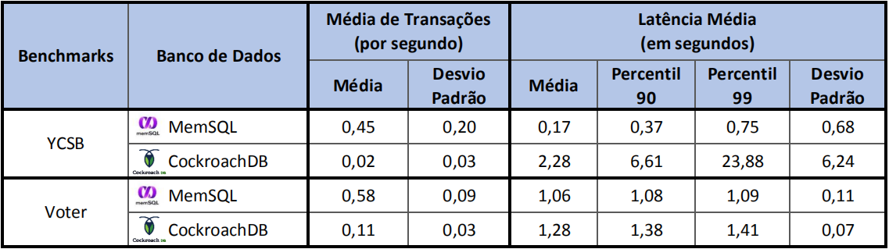
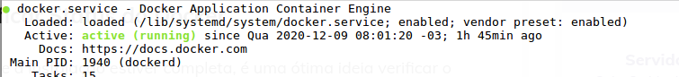

<p align="center">
  
</p>

A estrutura deste tutorial online está fixada em cinco tópicos gerais que tratam desde os conceitos teóricos relacionados até o passo a passo das práticas a serem desenvolvidas. Consulte o sumário a seguir para estudar um tópico em particular ou acesse na sequência os materiais apresentados.

<a id="sumario"></a>
# Sumário
1. [Introdução](#intro-sec1)
	1. [O que é NewSQL?](#newsql-sec1a)
	2. [O que é Disponibilidade?](#disponibilidade-sec1b)
	3. [Contextualização do Tutorial](#contexto-sec1c)
	4. [Recursos Utilizados](#recursos-sec1d)
	5. [Benchmarks com CockroachDB e MemSQL](#benchmark-sec1e)
2. [Instalação das Ferramentas](#instalacoes-sec2)
	1. [Docker](#docker-sec2a)
	2. [CockroachDB](#cockroachdb-sec2b)
	3. [MemSQL](#memsql-sec2c)
3. [Criação do Cluster Utilizando o Docker](#criar-cluster-sec3)
	1. [CockroachDB](#cockroachdb-sec3a)
	2. [MemSQL](#memsql-sec3b)
4. [Trabalhando com a Disponibilidade: Práticas e Resultados](#praticas-sec4)
	1. [Estudo de caso com o CockroachDB](#estudo-cockroachdb-sec4a)
	2. [Estudo de caso com o MemSQL](#estudo-memsql-sec4b)
	3. [Resultados e comparações entre o CockroachDB e o MemSQL](#resultados-sec4c)
5. [Conclusão](#conclusao-sec5)
	1. [Sumarização do que foi aprendido](#aprendizados-sec5a)
6. [Glossário](#glossario-sec6)
7. [Referências Bibliográficas](#referencias-sec7)

<a id="intro-sec1"></a>
# Introdução
A Introdução contempla uma visão geral dos tópicos a serem abordados no tutorial. Também são apresentados as algumas descrições acerca da configuração dos recursos utilizados. Este primeiro tópico foca em expor definições respectivas a: NewSQL, disponibilidade e terminologias relacionadas aos recursos selecionados.

>@Suellen: apontamento da @Sahudy na apresentação - é preciso falar quais são os recursos de alta disponibilidade que cada banco disponibiliza, junto de estudos comparativos de benchmark entre as ferramentas selecionadas. Pode ser que esse tipo de informação fique pertinente após a subseção de 'recursos utilizados'.

<a id="newsql-sec1a"></a>
## O que é NewSQL?
Os bancos de dados relacionais tradicionais surgiram em um tempo onde a necessidade de armazenamento e gravações eram menores e o acesso não era concorrido [(STONEBRAKER et al. 2007)](#STONEBRAKER-2007). Com a web 3.0, onde milhões de dados são gerados, gravados e acessados com rapidez, foi criado o NoSQL. Oferecendo acesso rápido e escalonamento horizontal, o NoSQL focou em resolver problemas relacionados à manutenção e interação com dados volumosos. Para lidar com o novo contexto o NoSQL se apoia no teorema CAP (**C**onsistency, **A**vailability e **P**artition tolerance), onde para se obter alta disponibilidade se faz necessário manejar os níveis de consistência.

O NoSQL trouxe alterações em relação ao paradigma relacional em termos de uso e manutenção das bases de dados. O primeiro ponto a ser observado é que o NoSQL não utiliza a linguagem SQL para consultas e gravações, e para garantir disponibilidade os resultados podem não ser consistentes. Estas alterações geraram grandes dúvidas quanto a sua adesão por parte da comunidade que já estava habituada com os paradigmas tradicionais. Desta forma, iniciaram-se pesquisas para desenvolver um SGBDR que utilizasse a mesma linguagem já conhecida e consolidada no mercado, que garantisse transações ACID (?????), que fossem escaláveis e altamente disponíveis. Fruto destas pesquisas surgiram os SGBDs New SQL. Segundo [Stonebraker e Cattell (2011)](#STONEBRAKER-2011), as cinco características de um SGBD NewSQL são: 
 
* Linguagem SQL como meio de interação entre o SGBD e a aplicação; 
* Suporte para transações ACID; 
* Controle de concorrência não bloqueante, para que as leituras e escritas não causem conflitos entre si; 
* Arquitetura que forneça um maior desempenho por nó de processamento; 
* Arquitetura escalável, com memória distribuída e com capacidade de funcionar em um aglomerado com um grande número de nós.

O paradigma NewSQL surge então para combinar os benefícios do paradigma relacional com o tratamento de Big Data suportados pelo paradigma NoSQL. Sistemas NewSQL são soluções modernas que buscam prover o mesmo desempenho escalável dos BDs NoSQL para transações OLTP (Online Transaction Processing) com suporte a todas as propriedades ACID, como encontrado nos BDRs [(KNOB et al., 2019)](#KNOB-2019).

<a id="disponibilidade-sec1b"></a>
## O que é Disponibilidade?

A disponibilidade é a uma característica de sistemas que podem se manter ativos pelo máximo de tempo possível. Em sistemas de banco de dados isto significa atender uma requisição do usuário (seja ela de leitura, escrita ou modificação) sempre que solicitado. Desta forma pode-se concluir que um sistema é disponível quando responde sempre às requisições com sucesso, e indisponível quando ocorre falha [(REZENDE, 2013)](#REZENDE-2013).

Uma das grandes diferenças entre os bancos de dados relacionais tradicionais e os bancos de dados NoSQL está no tratamento da disponibilidade. Para garantir disponibilidade, os bancos NoSQL podem manejar cópias das informações em vários servidores, clusters e/ou nós. A replicação através de redundância aumenta a disponibilidade dos dados, podendo ainda melhorar a capacidade de resposta à leituras, pois com diversas cópias vários clientes podem solicitar a leitura a partir de locais diferentes. 

Outro fator relativo às replicações é a tolerância a falhas. Na hipótese de um servidor, ou cluster, ou nó falhar, o sistema direciona a requisição para outro ponto que contenha a mesma informação, logo, quanto maior o número de réplicas melhor poderão ser trabalhadas as questões relacionadas à tolerância a falhas [(MONGODB, 2020)](#MONGODB-2020).

<a id="contexto-sec1c"></a>
## Contextualização do Tutorial

Como enredo deste tutorial, a base de dados Northwind será utilizada. Esta base foi originalmente criada pela Microsoft e tem sido usada como contexto de estudo para vários tutoriais relacionados a banco de dados. Os dados são relativos a um cenário de vendas de uma empresa fictícia chamada “Northwind Traders”, que importa e exporta alimentos para todo o mundo [(YUGABYTE, 2020)](#YUGABYTE-2020). A base inclui dados sobre fornecedores, clientes, funcionários, produtos, distribuidores e ordens de pedidos.

>@Suellen: pode ser que aqui precisemos explicar um pouco mais sobre o BD a ser usado relacionado a uma "intro" dos cenários dos estudos que vamos apresentar em seções. posteriores. 

<a id="recursos-sec1d"></a>
## Recursos Utilizados

>@Suellen: um dos comentários da @Sahudy na apresentação foi "tentar falar o essencial na intro, deixar o tutorial enxuto". Pode ser que esta subsação diminua...

Os recursos que serão utilizados para a elaboração deste tutorial são: Docker; CockroachDB; e MemSQL.

O Docker é uma plataforma open source que fornece recursos para criar, executar, manejar e publicar containers [(MOLL, 2019)](#MOLL-2019). Containers são abstrações a nível de sistema operacional e se caracterizam por agrupar códigos, bibliotecas e dependências com o intuito de garantir a execução de um determinado aplicativo em um ambiente isolado do sistema host [(BRITO, 2020)](#BRITO-2020). A imagem de um container no Docker gera um pacote de software leve, autônomo e executável que inclui tudo o que é necessário para executar um aplicativo [(DOCKER, 2020)](#DOCKER-2020).

A finalidade de utilização do Docker neste tutorial encontra-se em abstrair especificidades relacionadas ao sistema host durante a instalação e utilização das ferramentas de banco de dados. Os clusters que servirão para as provas de conceito serão criados sob containers levando em consideração as recomendações dos desenvolvedores das ferramentas utilizadas. A versão utilizada neste tutorial será a Docker Community Edition (Docker CE, versão 19.03, gratuita).

>@Suellen: cabe aqui uma imagem para expor o "visual" da aplicação Docker.

O CockroachDB é um dos bancos de dados selecionados para o tutorial. Ele é um banco de dados relacional que trabalha com linguagem SQL, suportada por uma API do PostgreSQL, capaz de fornecer escalabilidade e consistência em sistemas distribuídos. Ele também suporta transações ACID, além de possuir autogestão na replicação e fragmentação dos dados no cluster, evitando qualquer alteração manual nos dados [(COCKROACH LABS, 2020a)](#COCKROACH-2020A).

O CockroachDB é caracterizado por ser um sistema que permite o desenvolvimento de aplicações com alta disponibilidade. Seus recursos permitem manejar situações relacionadas a queda de alguns nós da infraestrutura de forma transparente, sem que a aplicação perca acesso aos dados [(PAT RESEARCH, 2020)](#PAT-2020).

A escolha do CockroachDB deve-se a documentação e materiais de apoio (blog, vídeos) disponíveis no site oficial para utilização do banco. Além de ser um banco de dados dedicado a tratar a disponibilidade. A versão utilizada é o CockroachDB Core (versão 20.1.7, gratuita).

>@Suellen: cabe aqui uma imagem para expor o "visual" da aplicação CockroachDB.

O MemSQL é o segundo banco de dados selecionado para o tutorial. Ele é um banco de dados relacional distribuído que lida com transações ACID e análises em tempo real, trabalhando com escalabilidade horizontal. Fornece suporte à sintaxe SQL e é compatível com o MySQL, permitindo com que aplicativos que usam de um driver do MySQL possam se conectar ao MemSQL de maneira transparente [(MEMSQL, 2020a)](#MEMSQL-2020A).

O MemSQL também tem como característica chave fornecer alta disponibilidade em um sistema distribuído através do compartilhamento de cópias dos dados entre os nós do cluster. Desta forma, é possível perder contato com alguns nós sem deixar o sistema todo inoperante. Quanto ao funcionamento das transações, para assegurar a disponibilidade, estas são confirmadas no disco como registros de log e replicadas automaticamente, suportando a queda de um nó e usando dados de logs para recuperar as transações confirmadas [(MEMSQL, 2020a)](#MEMSQL-2020A).

A escolha do MemSQL também é associada a documentação e materiais de apoio disponíveis no site oficial para utilização do banco. Além de ser um banco de dados que prioriza a disponibilidade. A versão utilizada é o MemSQL Software (versão 7.1, gratuita).

>@Suellen: cabe aqui uma imagem para expor o "visual" da aplicação MemSQL.

<a id="benchmark-sec1e"></a>
## Benchmarks com CockroachDB e MemSQL

Benchmark (na computação) é o ato de comparar de forma eficiente a performance entre dispositivos ou softwares utilizando um ou mais programas para efetuar simulações, testes padronizados e ensaios. Para comparar o desempenho de softwares de maneira equivalente, é preciso realizar uma série de testes e analisar diferentes tipos de dados [(COSTA, 2020)](#COSTA-2020). Existem na literatura alguns estudos recentes que apresentam benchmarks com diferentes soluções NewSQL. Aqui, serão comentados dois estudos identificados.

O trabalho de [Knob et al. (2019)](#KNOB-2019) compara soluções NewSQL, sendo duas delas o MemSQL e CockroachDB, utilizando-se de dois softwares de benchmark focados em transações OLTP (*Yahoo! Cloud Serving Benchmark - YCSB* e *Voter*) em um ambiente distribuído. Os experimentos consideraram um cluster de três nós físicos e as métricas avaliadas foram a taxa de transações executadas no tempo (*Throughput*) e a latência das transações, através da análise da média geral das latências. 

O benchmark YCSB gera uma carga de trabalho mista com operações de leitura e escrita, incluindo diferentes volumes de dados e número de requisições. A ferramenta realiza escolhas aleatórias, como as operações que serão feitas (Insert, Update, Read ou Scan), qual registro ler ou escrever, e quantos registros examinar. Já o benchmark Voter simula a saturação de um cenário em que o BD receberá requisições constantes, sendo cada requisição associada ao voto de uma pessoa para um determinado candidato. Ao receber uma requisição, a aplicação invoca uma transação para atualizar o número total de votos de cada participante, enquanto uma segunda transação contabiliza todos os votos. Cada teste foi configurado com um fator de escala em 1000 e com 64 usuários virtuais emulados para manipulação (64 conexões simultâneas).

O estudo de [Knob et al. (2019)](#KNOB-2019) revelou que ao analisar as médias de transações por segundo, nos dois benchmarks, o MemSQL foi superior ao CockroachDB, tanto em ambientes que solicitam requisições variadas como uniformes. Já os resultados sobre a latência média do CockroachDB no benchmark YCSB mostrou que em 99% das requisições feitas ao BD, a latência média era de quase 24 segundos, apresentando um desempenho ruim do CockroachDB quando comparado ao MemSQL. Essa discrepância não ocorreu no benchmark Voter, que trabalhou com transações menores e de apenas um tipo. Assim, o MemSQL obteve alta taxa de *throughput* e baixa latência, com diferenças consideráveis ao CockroachDB, como apresenta os resultados da <span style="color:red">Figura X</span>. 

<p align="center">
  
  <br/>
  <caption><span style="color:#696969"> Figura X: Medidas obtidas nos benchmarks | Fonte: Adaptado de Knob et al. (2019) </span></caption>
</p>

O segundo estudo apresentado trata de .....

>@Suellen: falar de mais um estudo, com foco em disponibilidade. Pode ser que o artigo do Kaur et al. seja viável aqui...

| :-------:
| [Voltar ao Sumário](#sumario)

<a id="instalacoes-sec2"></a>
# Instalação das Ferramentas

Neste tópico serão abordados os passos e códigos utilizados para instalar as ferramentas utilizadas ao longo do tutorial. A seção conterá informações como: partes de tutoriais oficiais da instalação já disponíveis na Internet; recomendações sobre os ambientes de instalação; prints de tela; e informações relacionadas a configuração do ambiente.

<a id="docker-sec2a"></a>
## Docker

Para o tutorial de instalação do **Docker** será considerado um computador com o sistema operacional Linux Mint na versão 18.3. Informações sobre a instalação em outros sistemas operacionais podem ser consultados diretamente na documentação oficial por meio dos links:

- Windows: [Tutorial de instalação no Windows](https://docs.docker.com/docker-for-windows/install/)
- Mac: [Tutorial de instalação no Mac](https://docs.docker.com/docker-for-mac/install/)

Antes de começar a instalação no Linux, é importante garantir que seu usuário tem permissões de administrador. Para testar se seu usuário possui permissão de administrador execute no terminal o comando `sudo -v`, se o terminal solicitar sua senha significa que você possui permissão, caso contrário será exibida uma mensagem de erro.

Após constatar que possui privilégios de administrador você deve atualizar o cache das listas de repositórios, para isto execute o comando `sudo apt-get update`. Pronto, privilégios checados, lista de repositórios atualizada, estamos prontos para a instalação!

Para começar a instalação devemos primeiro garantir que as dependências do instalador do docker estão satisfeitas, estas depêndencias são:

- `apt-transport-https`: para permitir que o gerenciador de pacotes transfira os dados através de https;
- `ca-certificates`: habilitar o sistema a verificar certificados de segurança;
- `curl`: para transfirir dados;
- `software-properties-common`: scripts para gerenciar o software.

Para instalar todos eles ao mesmo tempo podemos executar apenas um comando: `sudo apt-get install  curl apt-transport-https ca-certificates software-properties-common`. Não se preocupe em analisar se estes softwares já estão presentes no seu sistema, o `APT-GET` é inteligente e não irá baixar pacotes que já estão instalados, e caso a versão instalada seja antiga ele irá atualizar ;).

A instalação oficial do Docker não está presente nas listas básicas de aplicativos do Linux. Mas isto não é motivo para preocupação, com apenas duas linhas de código já seremos capazes de acessar o repositório oficial. O primeiro passo é adicionar a chave CPG oficial do docker para garantir a segurança enquanto baixamos os arquivos do repositório oficial, o comando é este: `curl -fsSL https://download.docker.com/linux/ubuntu/gpg | sudo apt-key add -`.

Tendo adicionado a chave agora vamos adicionar o repositório da última versão estável do Docker em nossas lista através do comando: `sudo add-apt-repository "deb [arch=amd64] https://download.docker.com/linux/ubuntu $(lsb_release -cs) stable"`. Como acabamos de adicionar um novo repositório em nossas listas, devemos atualizar novamente o cache com o comando `sudo apt-get update`.

Chegou a hora esperada: instalar o docker-ce. Para isto basta executar o comando: `sudo apt install docker-ce`. Após concluir o processo de instalação (que é todo automatizado) podemos confirmar se o docker está ligado através do comando: `sudo systemctl status docker`, caso tenha ocorrido tudo bem devemos observar uma mensagem deste tipo:

<p align="center">
  
</p>

Neste ponto estamos habilitados a seguir com as instalações, pois nosso docker está instalado e operante :D.

<a id="cockroachdb-sec2b"></a>
## CockroachDB

Todas as versões do CockroachDB são distribuidas em formato binário, isto significa que não há um instalador. Para utilização do CockroachDB basta fazer o download dos arquivos para o sistema operacional utilizado, extrair em uma pasta e executar o sistema. Para este tutorial iremos utilizar a versão do sistema que funciona sobre container Docker, para isto utilizaremos a imagem distribuida oficialmente pelo fabricante através do Docker Hub.

Tendo o Docker já instalado, basta executar o comando `sudo docker pull cockroachdb/cockroach:v20.1.9`. Este comando irá verificar se esta imagem já existe em seu computador, caso não exista ele fará o download. Não é necessário mais nenhum passo para a instalação, a utilização desta imagem será abordada na seção de criação do cluster utilizando o [CockroachDB](#cockroachdb-sec3a), onde criaremos um container para cada nó da nossa arquitetura.


<a id="memsql-sec2c"></a>
## MemSQL

O MemSQL é uma ferramenta paga. Para a ocasião deste tutorial iremos utilizar a versão gratuita que possui diversas limitações de utilização, porém, servirá para nosso propósito de prova de conceito. Antes de iniciar a instalação é preciso criar uma conta para obter uma liçenca (chave de acesso) para a versão gratuita. O cadastro deve ser feito por meio [deste link](https://www.singlestore.com/free/).

A versão grátis do MemSQL trata-se de apenas um container Docker onde existem três instâncias do banco de dados. A fabricante chama esta instalação de "cluster-in-a-box" pois toda a configuração do banco acontece de forma automática dentro do container e o usuário não pode interferir (caixa preta). Para instalação do MemSQL basta criar um arquivo de configuração com informações básicas para que o Docker faça todo o trabalho, este arquivo é o `docker-compose.yaml` e ele deve conter este conteudo:

~~~docker-compose.yaml
version: '2'

services:
  memsql:
    image: 'memsql/cluster-in-a-box'
    ports:
      - 3306:3306
      - 8080:8080
    environment:
      LICENSE_KEY: <sua chave de acesso deve ser colocada aqui>
      START_AFTER_INIT: 'Y' 
~~~

Para entender melhor os passos que serão executados de forma automática pelo Docker faremos uma breve explicação do conteudo deste arquivo:

- A tag `services` contém toda informação relacionada ao container que o Docker deve configurar, neste caso o Docker irá criar um container chamado `memsql` que utilizará a imagem `memsql/cluster-in-a-box` presente no Docker Hub;
- A tag `ports` faz um mapeamento entre as portas do container e do computador host, sendo a primeira porta relativa ao container e a segunda ao host. Por exemplo, o comando `80:8888` indica que a porta 80 do container será mapeada para a porta 8888 do computador host. O arquivo de .yaml está fazendo um redirecionamento direto utilizando as mesmas portas para container e host, agora com o entendimento de como funciona você será capaz de manejar estas portas caso elas já estejam em uso no host, mantendo atenção para alterar apenas o 2º parâmetro;
- A tag `LICENSE_KEY` deve conter a chave de acesso que conseguimos ao se cadastrar no site oficial. Em um ambiente real de uso não é recomendado manter a chave de acesso salva no arquivo por questões de segurança, neste casos é recomendado utilizar as "variáveis de ambiente". Para mais informações sobre este tipo de utilização pode ser conferida na [documentação oficial](https://docs.singlestore.com/v7.1/guides/use-memsql/develop/getstarted/free/);
- A tag `START_AFTER_INIT` é apenas uma garantia para que o container não se desligue durante a utilização, deixe ela ali ;).

Ao executar o `docker-compose.yaml` o Docker pode criar alguns arquivos ocultos no local onde o arquivo se encontra, por isto é recomendado salvar este arquivo em uma pasta específica para o MemSQL. Após criar a pasta e salvar o arquivo o processo de instalação está concluido!. 

**Atenção**: 
- O download da imagem oficial do Docker Hub só vai acontecer na primeira inicialização do cluster que será descrita na seção de criação de cluster usando o [MemSQL](#memsql-sec3b);
- O sistema exige ao menos 10GB livres no HD para poder iniciar, ele irá ocupar todo este espaço, mas é um requisito para criar o cluster.


| :-------:
| [Voltar ao Sumário](#sumario)

<a id="criar-cluster-sec3"></a>
# Criação do Cluster Utilizando o Docker

<a id="cockroachdb-sec3a"></a>
## CockroachDB

Para criar o cluster com o CockroachBD será necessário criar três containers, cada um terá uma instancia do banco de dados e representará um computador diferente. A comunicação entre os containers acontecerá por meio de uma rede interna do Docker, e este será o primeiro passo para criar o cluster. Para criar a rede devemos executar o comando: `docker network create -d bridge roachnet`. Este comando irá criar, no ambiente do Docker, uma rede chamada **roachnet**. Isto significa que apenas os containers podem ver e usar essa rede, exatamente como uma rede local. O nome roachnet é arbitrário e pode ser alternado conforme seu gosto, basta recordá-lo pois iremos utilizar nos próximos comandos.

Para organizar os arquivos do Docker devemos criar uma pasta chamada `cockroach-data`. dentro desta pasta devemos criar outras três, uma para cada container que iremos inicializar, sendo: `roach1`, `roach2` e `roach3`. **Dica:** crie esta pasta em um diretório com o caminho pouco complexo, pois nos próximos comandos nós iremos escrever este endereço.

Para iniciar o primeiro container iremos executar no terminal o seguinte comando:

~~~docker
docker run -d \
--name=roach1 \
--hostname=roach1 \
--net=roachnet \
-p 26257:26257 -p 8080:8080  \
-v "rota_para_a_pasta/cockroach-data/roach1:/cockroach/cockroach-data"  \
cockroachdb/cockroach:v20.1.7 start \
--insecure \
--join=roach1,roach2,roach3
~~~

Explicação:

- O `docker run` indica que um container deve ser iniciado, caso ele não exista, será criado;
- O flag `name` é a identificação do container que será criado, ele pode ser alterado, porém, existem outras referências para este nome, caso queira colocar outro nome tenha isto em mente e atualize todas as referências;
- O `hostname` serve para a identificação durante a configuração da rede interna;
- A flag `net` faz referência a rede na qual nosso container irá se conectar, no caso do exemplo vamos nos conectar na **roachnet** que foi criada nos passos anteriores, caso você tenha alterado o nome da rede no passo anterior **atenção aqui**;
- As flags `p` indicam o redirecionamento de portas do container -> host, no geral não precisam ser alteradas. Lembrando que as portas relacionadas container (1º parametro) não devem ser alternadas;
- A flag `-v` é um direcionamento entre uma pasta existente dentro do container e uma pasta no computador host, isto é necessário pois o container não tem um armazenamento permanente e todos os dados são apagados quando o container desliga. Os dados salvos nesta pasta ficarão salvos no computador host e serão usados pelo container;
- O comando `cockroachdb/cockroach:v20.1.9 start` irá iniciar, dentro do container recem criado, a imagem que fizemos o download na seção de instalação;
- A flag `insecure` faz parte da implementação voltada a teste do CockroachDB, ela **não deve ser alterada**;
- Uma das tags mais imporantes é a `join`, ela ira indicar quais containers devem se conectar dentro da rede local do Docker, no caso do exemplo os containers de hostname roach1,roach2 e roach3 serão conectados.

Após executar este comando teremos o container principal ativo, porém, ainda faltam os nós que compoem a estrutura básica do cockroach. Após entender bem a estrutua do comando que inicia o container principal podemos notar que para iniciar outro container só precisamos mudar o: `name`, `hostname`, e a rota/pasta da flag `v`. Como a conexão da maquina host será realizada apenas com o container principal, os outros containers (nós) não precisam de configuração de portas, a rede local do Docker basta.

Então para subir o container **roach2**:

~~~docker
docker run -d \
--name=roach2 \
--hostname=roach2 \
--net=roachnet \
-v "rota_para_a_pasta/cockroach-data/roach2:/cockroach/cockroach-data"  \
cockroachdb/cockroach:v20.1.7 start \
--insecure \
--join=roach1,roach2,roach3
~~~

E o container **roach3**:

~~~docker
docker run -d \
--name=roach3 \
--hostname=roach3 \
--net=roachnet \
-v "rota_para_a_pasta/cockroach-data/roach3:/cockroach/cockroach-data"  \
cockroachdb/cockroach:v20.1.7 start \
--insecure \
--join=roach1,roach2,roach3
~~~

Após executar estes comandos com sucesso teremos três containers ligados, cada um rodando uma instância do CockroachDB. Para inicializar o cluster basta executar o comando: `docker exec -it roach1 ./cockroach init --insecure`. Este comando irá iniciar o sistema do CockroachDB dentro do container **roach1** e toda a configuração restante acontecerá automaticamente. Neste ponto teremos um cluster de CockroachDB ativo, onde o container **roach1** é o principal e os outros são seus nós secundários :).

**Recordando**: Cada container é uma instalação unica do CockroachDB. O unico container que tem comunicação aberta com a maquina host é o principal. O dados utilizados pelo banco (incluindo os binários que salvam as informações armazenadas dentro do banco) serão salvas na pasta atrelada à tag `v`. A comunicação entre containers é feita via rede interna do Docker.

<a id="memsql-sec3b"></a>
## MemSQL

A criação do cluster utilizando o MemSQL acontece de forma transparente para o usuário, para iniciar o processo é necessário abrir o terminal e navegar até a pasta onde o arquivo `docker-compose.yaml` foi salvo. Após acessar a pasta executar o comando: `docker-compose up`, ao executar este comando o docker irá vasculhar a pasta atual por um arquivo `docker-compose.yaml` e quando encontrar irá executá-lo. Neste ponto todos os comandos escritos no arquivo `docker-compose.yaml` serão executados. Caso seja a primeira execução é neste ponto que a imagem do sistema será baixada do Docker Hub.

| :-------:
| [Voltar ao Sumário](#sumario)

<a id="praticas-sec4"></a>
# Trabalhando com a Disponibilidade: Práticas e Resultados

Para realizar um teste de disponibilidade em cada uma das soluções NewSQL apresentadas, foram desenvolvidas instruções SQL (?????) que atendem a três tipos de comandos, sendo eles de escrita-escrita, leitura-escrita e leitura-leitura. Escrita-escrita é relacionado a comandos INSERT que efetuam a gravação de um novo registro em banco, leitura-escrita inclui instruções como UPDATE (para atualizar) e DELETE (para apagar) um registro existente em banco, e leitura-leitura é associado aos comandos SELECT para selecionar dados de uma ou mais tabelas. Para manter um padrão na quantidade de comandos, foram desenvolvidas 20 instruções para cada um dos tipos mencionados, gerando assim um total de 60 comandos.

A base de dados Northwind possui 13 tabelas no total (como mostrado na seção X), porém, vale ressaltar que os comandos apresentados para a prática destinam-se apenas às tabelas “customers” e “orders”. As instruções foram limitadas a estas duas tabelas justamente para ser possível avaliar resultados acerca da disponibilidade fornecida por diferentes soluções NewSQL que foram submetidas ao mesmo conteúdo de teste.

>@Suellen: imagem com a relação de tabelas a serem trabalhadas no experimento

Os 60 comandos do experimento prático são divididos em dois conjuntos (Grupo A e Grupo B), com 30 instruções cada. Essa divisão também distribui igualmente a variedade de comandos por tipo em cada grupo. Ou seja, cada grupo possui 10 comandos de escrita-escrita, mais 10 instruções de leitura-escrita e outros 10 comandos de leitura-leitura, organizados de maneira intercalada. Cada grupo de comandos precisa ser executado na mesma ordem, respeitando a sequência em que são apresentados neste tutorial.

Diante desta introdução, siga os procedimentos dados em cada estudo de caso a seguir. Após o passo a passo efetuado em cada estudo, este tutorial abordará sobre algumas métricas e resultados obtidos na aplicação dos comandos, respectivos à disponibilidade dos dados.

>@Suellen: um dos comentários da @Sahudy na planilha foi "slide 10. def dos conceitos em cada implementacao." Acredito que nesta seção, termos como JOIN, INSERT, UPDATE e outras coisas que aparecerem, precisam ter um explicação sucinta na seção Glossário.

>@Suellen: apontamento da @Sahudy na apresentação - focar em comandos do tipo leitura-escrita e escrita-escrita, que são os tipos que apresentarão "problemas" ao funcionamento dos bancos.

>@Suellen: Colocar aqui uma breve lógica do funcionamento de cada BD, de acordo com o que temos no relatório (seção 4) + artigo Knob et al. (2019). -  SERÁ QUE AINDA VAI SER AQUI NESTA SEÇÃO PARA FALAR DISSO?

<a id="estudo-cockroachdb-sec4a"></a>
## Estudo de caso com o CockroachDB

- **Passo 1: Com o CockroachDB ativo com 3 nós em seu cluster e com o banco de daods Northwind pronto para uso, abra a tela ??????????. Nela, execute os comandos (Grupo A) apresentados, de uma só vez:**

>@Suéllen: COMANDOS DO GRUPO A

Observe as saídas emitidas pela aplicação. Se o CockroachDB permitir a execução dos comandos e tudo correr como esperado, o retorno apresentado após a última instrução será “??????”, como mostra a Figura X.

>@Suéllen: figura X para apresentar saída ao final da execução dos comandos do Grupo A.

Observe saídas respectivas ao tempo de execução das instruções, frequência de requisições a um nó específico e outras métricas na tela ????????????, como no exemplo da Figura Y.

>@Suéllen: figura Y para apresentar tela com gráficos / números / índices emitidos ao executar essas instruções no BD

- **Passo 2: Agora vamos forçar a queda de um dos nós secundários do nosso cluster no CockroachDB. Para isso, acesse a tela ?????????? e aplique a seguinte instrução:**

>@Suéllen: COMANDO PARA QUEDA DE UM NÓ SECUNDÁRIO NO COCKROACHDB

Novamente, observe as respostas emitidas pela aplicação e confira se realmente o seu cluster agora está operando com dois nós. Se a resposta emitida for “???????????????” quer dizer que nossa configuração está ok. 

- **Passo 3: Com esta nova configuração do cluster, vamos executar nosso segundo grupo de comandos (Grupo B). Novamente, acesse a tela ????????? e rode as instruções a seguir, de uma só vez:**

>@Suéllen: COMANDOS DO GRUPO B

Observe as saídas emitidas pela aplicação. E agora, tudo ocorreu bem? Se a aplicação te retornar uma mensagem tipo “?????????????”, quer dizer que o banco de dados não suportou operar com 2 nós e ficou indisponível, como mostra a Figura Z.

>@Suéllen: figura Z para apresentar saída ao final da execução dos comandos do Grupo B (PRIMEIRA TENTATIVA).

Porém, se o CockroachDB fornecer uma mensagem semelhante ao retorno obtido no Passo 1, então quer dizer que mesmo com 2 nós em atividade o banco manteve-se disponível. 

Antes de prosseguir, independentemente do resultado obtido até esta etapa, observe novamente as saídas de tempo de execução das instruções, frequência de requisições a um nó específico e outras métricas na tela ???????????? e, em especial, identificar onde ocorreu uma falha, como no exemplo da Figura X.

>@Suéllen: figura X para apresentar tela com gráficos / números / índices emitidos ao executar essas instruções no BD - Grupo B - Primeira Tentativa.

Se ao final do Passo 3 você não obteve um retorno positivo do banco em relação à disponibilidade, prossiga com as etapas seguintes deste experimento. Caso contrário, vá direto para a próxima subseção.

- **Passo 4: Vamos retornar o nosso cluster no CockroachDB para a configuração inicial (com 3 nós), subindo um nó secundário. Para isso, acesse a tela ?????????? e aplique a seguinte instrução:**

>@Suéllen: COMANDO PARA ATIVAR UM NÓ SECUNDÁRIO NO COCKROACHDB

Repare nas respostas emitidas pela aplicação e confira se realmente o seu cluster voltou a operar com três nós. Se a resposta emitida for “???????????????” quer dizer que nossa configuração está ok.

- **Passo 5: Novamente, vamos executar nosso segundo grupo de comandos (Grupo B). Acesse a tela ????????? e rode as instruções a seguir, de uma só vez:**

>@Suéllen: COMANDOS DO GRUPO B - MESMOS COMANDOS, SEGUNDA TENTATIVA

Observe as saídas emitidas pela aplicação. E desta vez, tudo ocorreu bem? Se a aplicação te retornar uma mensagem tipo “?????????????”, semelhante a mensagem obtida ao efetuar o Passo 1, então quer dizer que nosso banco só conseguiu fornecer disponibilidade com, no mínimo, 3 nós em operação. 
Pela última vez, observe as saídas respectivas ao tempo de execução das instruções, frequência de requisições a um nó específico e outras métricas na tela ????????????, como no exemplo da Figura S.

>@Suéllen: figura S para apresentar tela com gráficos / números / índices emitidos ao executar essas instruções no BD

Desta vez, faça uma comparação pessoal destes resultados, com os valores obtidos após a execução dos comandos do Grupo A. Logo logo vamos discutir estes resultados com você.


**O ESTUDO DE CASO TERMINA AQUI, ABAIXO APENAS COMENTÁRIOS DA SEÇÃO.**

>@Suellen: Descrição do estudo e comandos aplicados ao BD; resultados obtidos no BD

>@Suellen: apontamento da @Sahudy na apresentação - os mesmos dados e tabelas (comandos) devem ser afetados nos dois bancos (para gerar concorrência). Isso vale para todos os tipos de comando (joins, inserts, updates, etc).

>@Suellen: ideia para expor resultados em cada estudo, segundo apontamentos da @Sahudy - comparar comandos e seus resultados em grupos de leitura-leitura, leitura-escrita e escrita-escrita.

<a id="estudo-memsql-sec4b"></a>
## Estudo de caso com o MemSQL

>@Suellen: Descrição do estudo e comandos aplicados ao BD; resultados obtidos no BD

>@Suellen: apontamento da @Sahudy na apresentação - os mesmos dados e tabelas (comandos) devem ser afetados nos dois bancos (para gerar concorrência). Isso vale para todos os tipos de comando (joins, inserts, updates, etc).

>@Suellen: ideia para expor resultados em cada estudo, segundo apontamentos da @Sahudy - comparar comandos e seus resultados em grupos de leitura-leitura, leitura-escrita e escrita-escrita.

<a id="#resultados-sec4c"></a>
## Resultados e comparações entre o CockroachDB e o MemSQL

| :-------:
| [Voltar ao Sumário](#sumario)

<a id="conclusao-sec5"></a>
# Conclusão

>@Suellen: apontamento da @Sahudy na apresentação - apresentar uma tabela comparativa de 'desempenho' dos bancos, no sentido de comportamento deles ao tratar de cada tipo de requisição. Acredito que isso pode ser aqui ou em subseções de cada estudo de caso aplicado na seção 4.

<a id="aprendizados-sec5a"></a>
## Sumarização do que foi aprendido

<a id="glossario-sec6"></a>
# Glossário

| :-------:
| [Voltar ao Sumário](#sumario)

<a id="referencias-sec7"></a>
# Referências Bibliográficas

<a id="BRITO-2020"></a>
- BRITO, Michelli. [Containers e Docker](https://www.youtube.com/watch?v=TR8zX1D6abU). Canal Michelli Brito, 2020.
<a id="COCKROACH-2020A"></a>
- COCKROACH LABS. [CockroachDB: Distributed SQL](https://www.cockroachlabs.com/product/). Cockroach Labs, 2020a.
<a id="COSTA-2020"></a>
- COSTA, Matheus Bigogno. [O que é Benchmark?](https://canaltech.com.br/hardware/O-que-e-Benchmark/). CanalTech, 2020.
<a id="DOCKER-2020"></a>
- DOCKER. [What is a Container?: a standardized unit of software](https://www.docker.com/resources/what-container). Docker Inc. 2020.
<a id="KNOB-2019"></a>
- KNOB, Ronan R. et al. [Uma Análise de Soluções NewSQL](??? LINK ????). ????? EVENTO ?????, p. ??? - ???, MÊS. 2019.
<a id="MEMSQL-2020A"></a>
- MEMSQL. [How MemSQL Works](https://docs.memsql.com/v7.1/introduction/how-memsql-works/). MemSQL Docs, 2020a. 
<a id="MOLL-2019"></a>
- MOLL, Vinicius. [Como construir uma aplicação com Docker?](https://blog.geekhunter.com.br/docker-na-pratica-como-construir-uma-aplicacao/) GeekHunter, 2019.
<a id="MONGODB-2020"></a>
- MONGODB. [MongoDB Documentation: Replication](https://docs.mongodb.com/manual/replication/). 2020.
<a id="PAT-2020"></a>
- PAT RESEARCH. [CockroachDB](https://www.predictiveanalyticstoday.com/cockroachdb/). Pat Research - Predictive Analytics Today, 2020.
<a id="REZENDE-2013"></a>
- REZENDE, Ricardo. [Alta disponibilidade no banco de dados Oracle](https://www.devmedia.com.br/alta-disponibilidade-no-banco-de-dados-oracle/28971). DevMedia, 2013.
<a id="STONEBRAKER-2011"></a>
- STONEBRAKER, Michael, CATTELL, [Rick. 10 Rules for Scalable Performance in ‘Simple Operation’ Datastores](https://doi.org/10.1145/1953122.1953144). Communications Of The Acm, v. 54, n. 6, p. 72-80, jun. 2011.
<a id="STONEBRAKER-2007"></a>
- STONEBRAKER, Michael et al. [The End of an Architectural Era (It’s Time for a Complete Rewrite)](http://nms.csail.mit.edu/~stavros/pubs/hstore.pdf). VLDB '07: Proceedings Of The 33Rd International Conference On Very Large Data Bases, p. 1150-1160, jul. 2007.
<a id="YUGABYTE-2020"></a>
- YUGABYTE. [Northwind sample database](https://docs.yugabyte.com/latest/sample-data/northwind/). YugabytesDB, 2020.


# Fim do tutorial e dicas de formatação markdown
**----------------- não apagar os comandos / conteúdos abaixo para vermos como exemplos de marcação do markdown ----------------------**

<a name="a"></a>
# Dica de Sumário
- [Título Inicial](#ancora1)
  - [Mark](#ancora2)
  - [Jekyll Themes](#ancora3)
    - [Support or Contact](#ancora4)

<a id="ancora1"></a>
# Dicas de Formatação para o Markdown

**Site sobre comandos markdown:** <https://docs.pipz.com/central-de-ajuda/learning-center/guia-basico-de-markdown#open>

Este texto apresenta um [teste de link aqui](https://www.youtube.com/watch?v=5B4bHSiOOO8) de um vídeo do **YouTube**.

**Exemplo para add códigos diferentes sobre um mesmo tema:**

~~~Linux
Esta é uma linha de código para ser feita no Linux.
~~~

~~~Windows
Esta é uma linha de código para ser feita no Windows.
~~~

**Exemplo 1 para add figuras:**  --> [acesse este material](https://www.youtube.com/watch?v=nvPOUdz5PL4) e faça os passos. É basicamente lançar uma imagem para a área de 'Issues' do github, copiar o código gerado da figura e não salvá-la no Issues. Basta ir ao README e colar o código da imagem copiado no Issues.

**Exemplo 2 para add figuras:** --> add código HTML chamando o caminho da figura a partir do subdiretório da imagem que deseja exibir, tipo:
```markdown
<p align="center">
  
</p>
```

Nesta linha há o exemplo de um `trecho.codigo()` embutido no parágrafo, mostrando a formatação alterada.

Nesta linha há um link, mostrado por inteiro e clicável como este: <https://u01.appmifile.com/images/2019/06/15/b0920166-f3e8-4ec6-826a-7ee96c313197.png>

<a id="ancora2"></a>
## Mark

Markdown is a lightweight and easy-to-use syntax for styling your writing. It includes conventions for

```markdown
Syntax highlighted code block

# Header 1
## Header 2
### Header 3

- Bulleted
- List

1. Numbered
2. List

**Bold** and _Italic_ and `Code` text

[Link](url) and 
```

For more details see [GitHub Flavored Markdown](https://guides.github.com/features/mastering-markdown/).

<a id="ancora3"></a>
## Jekyll Themes

Your Pages site will use the layout and styles from the Jekyll theme you have selected in your [repository settings](https://github.com/suellenmartinelli/ProjetoTeste/settings). The name of this theme is saved in the Jekyll `_config.yml` configuration file.

<a id="ancora4"></a>
### Support or Contact

Having trouble with Pages? Check out our [documentation](https://docs.github.com/categories/github-pages-basics/) or [contact support](https://github.com/contact) and we’ll help you sort it out.
