

  

A estrutura deste tutorial online está fixada em seis tópicos gerais que tratam desde os aspectos teóricos até o passo a passo das práticas a serem desenvolvidas. Consulte o sumário a seguir para estudar um tópico em particular ou acesse na sequência os materiais apresentados.

# Sumário
1. [Introdução](#intro-sec1)
	1. [O que é *NewSQL*?](#newsql-sec1a)
	2. [O que é Disponibilidade?](#disponibilidade-sec1b)
	3. [Contextualização do Tutorial](#contexto-sec1c)
	4. [Recursos Utilizados](#recursos-sec1d)
	5. [*Benchmarks* com CockroachDB e MemSQL](#benchmark-sec1e)
2. [Instalação das Ferramentas](#instalacoes-sec2)
	1. [Docker](#docker-sec2a)
	2. [CockroachDB](#cockroachdb-sec2b)
	3. [MemSQL](#memsql-sec2c)
3. [Criação do *Cluster* Utilizando o Docker](#criar-cluster-sec3)
	1. [CockroachDB](#cockroach-sec3)
- [Topologia do *Cluster*](#topologia-cockroach-sec3)
- [Criação do *Cluster*](#cockroachdb-sec3a)
	2. [MemSQL](#memsql-sec3)
- [Topologia do *Cluster*](#topologia-memsql-sec3)
- [Criação do *Cluster*](#memsql-sec3b)
4. [Trabalhando com a Disponibilidade: Práticas e Resultados](#praticas-sec4)
	1. [Estudo de caso com o CockroachDB](#estudo-cockroachdb-sec4a)
	2. [Estudo de caso com o MemSQL](#estudo-memsql-sec4b)
	3. [Resultados e comparações entre o CockroachDB e o MemSQL](#resultados-sec4c)
5. [Conclusão](#conclusao-sec5)
	1. [Sumarização do que foi aprendido](#aprendizados-sec5a)
6. [Glossário](#glossario-sec6) 
[Referências Bibliográficas](#referencias-sec7)

# 1 Introdução

A Introdução contempla uma visão geral dos tópicos a serem abordados e algumas descrições/explicações acerca dos recursos a serem utilizados neste tutorial. Aqui serão apresentadas definições respectivas a: *NewSQL*, disponibilidade, terminologias relacionadas aos recursos selecionados e contexto dos estudos de caso.

## 1.1 O que é *NewSQL*?

Os bancos de dados relacionais tradicionais surgiram em um tempo onde a necessidade de armazenamento e gravações eram menores e o acesso não era concorrido [(STONEBRAKER et al. 2007)](#STONEBRAKER-2007). Com a web 3.0, onde milhões de dados são gerados, gravados e acessados com rapidez, foi criado o *NoSQL*. Oferecendo acesso rápido e escalonamento horizontal, o *NoSQL* focou em resolver problemas relacionados à manutenção e interação com dados volumosos. Para lidar com o novo contexto o *NoSQL* se apoia no teorema *CAP* *(**C**onsistency, **A**vailability e **P**artition tolerance)*, onde para se obter alta disponibilidade se faz necessário manejar os níveis de consistência.

O *NoSQL* trouxe alterações em relação ao paradigma relacional em termos de uso e manutenção das bases de dados. O primeiro ponto a ser observado é que o *NoSQL* não utiliza a linguagem *SQL* para consultas e gravações, e para garantir disponibilidade os resultados podem não ser consistentes. Estas alterações geraram grandes dúvidas quanto a sua adesão por parte da comunidade que já estava habituada com os paradigmas tradicionais. Desta forma, iniciaram-se pesquisas para desenvolver um *SGBD* *(**S**istema de **G**erenciamento de **B**anco de **D**ados)* que utilizasse a mesma linguagem já conhecida e consolidada no mercado, que garantisse transações *ACID* *(**A**tomicity, **C**onsistency, **I**solation, **D**urability)*, que fossem escaláveis e altamente disponíveis. Como fruto destas pesquisas surgiram os SGBDs *NewSQL*.

Segundo [Stonebraker e Cattell (2011)](#STONEBRAKER-2011), as cinco características de um SGBD *NewSQL* são: 

* Linguagem *SQL* como meio de interação entre o SGBD e a aplicação; 
* Suporte para transações *ACID*; 
* Controle de concorrência não bloqueante, para que as leituras e escritas não causem conflitos entre si; 
* Arquitetura que forneça um maior desempenho por nó de processamento; 
* Arquitetura escalável, com memória distribuída e com capacidade de funcionar em um aglomerado com um grande número de nós.

O paradigma *NewSQL* surge então para combinar os benefícios do paradigma relacional com o tratamento de Big Data suportados pelo paradigma *NoSQL*. Sistemas *NewSQL* são soluções modernas que buscam prover o mesmo desempenho escalável dos sistemas *NoSQL* para transações *OLTP* *(Online Transaction Processing)* com suporte a todas as propriedades ACID, como encontrado nos SGBDs relacionais [(KNOB et al., 2019)](#KNOB-2019).

## 1.2 O que é Disponibilidade?

A disponibilidade é a uma característica de sistemas que podem se manter ativos pelo máximo de tempo possível. Em SGBDs isto significa atender uma requisição do usuário (seja ela de leitura, escrita ou atualização) sempre que solicitado. Desta forma pode-se concluir que um sistema é disponível quando responde sempre às requisições com sucesso, e indisponível quando ocorre falha ao concretizar uma consulta [(REZENDE, 2013)](#REZENDE-2013). 

Uma das grandes diferenças entre os SGBDs relacionais tradicionais e os SGBDs *NoSQL* está no tratamento da disponibilidade. Para garantir disponibilidade, os sistemas *NoSQL* podem manejar cópias das informações em vários servidores, *clusters* e/ou nós. A replicação através de redundância aumenta a disponibilidade dos dados, podendo ainda melhorar a capacidade de resposta à leituras, pois com diversas cópias vários clientes podem solicitar a leitura a partir de locais diferentes. 

Outro fator relativo às replicações é a tolerância a falhas. Na hipótese de um servidor, ou *cluster*, ou nó falhar, o sistema direciona a requisição para outro ponto que contenha o mesmo dado, logo, quanto maior o número de réplicas melhor poderão ser trabalhadas as questões relacionadas à tolerância a falhas [(MONGODB, 2020)](#MONGODB-2020).

Um conceito similar é a alta disponibilidade *(high avaliability)*, que caracteriza sistemas de informação resistentes a falhas de *hardware*, software e energia, cujo objetivo é manter os serviços disponíveis o maior tempo possível. Geralmente, quanto maior a necessidade de alta disponibilidade, maior precisa ser a redundância dos dados e custo das soluções, tendo em vista que isso depende do tipo de serviço (ramo da empresa, necessidades comerciais, etc) que se pretende disponibilizar [(WIKIPÉDIA, 2020)](#WIKI-2020). 

## 1.3 Contextualização do Tutorial

Como enredo deste tutorial, a base de dados *Northwind* será utilizada. Esta base foi originalmente criada pela Microsoft e tem sido usada como contexto de estudo para vários tutoriais relacionados a banco de dados. Os dados são respectivos a um cenário de vendas de uma empresa fictícia chamada *“Northwind Traders”*, que importa e exporta alimentos para todo o mundo [(YUGABYTE, 2020)](#YUGABYTE-2020).

A base de dados *Northwind* inclui 14 tabelas e dados sobre fornecedores, clientes, funcionários, produtos, distribuidores e ordens de pedidos. Os relacionamentos entre essas e demais entidades são apresentados na Figura 1.

  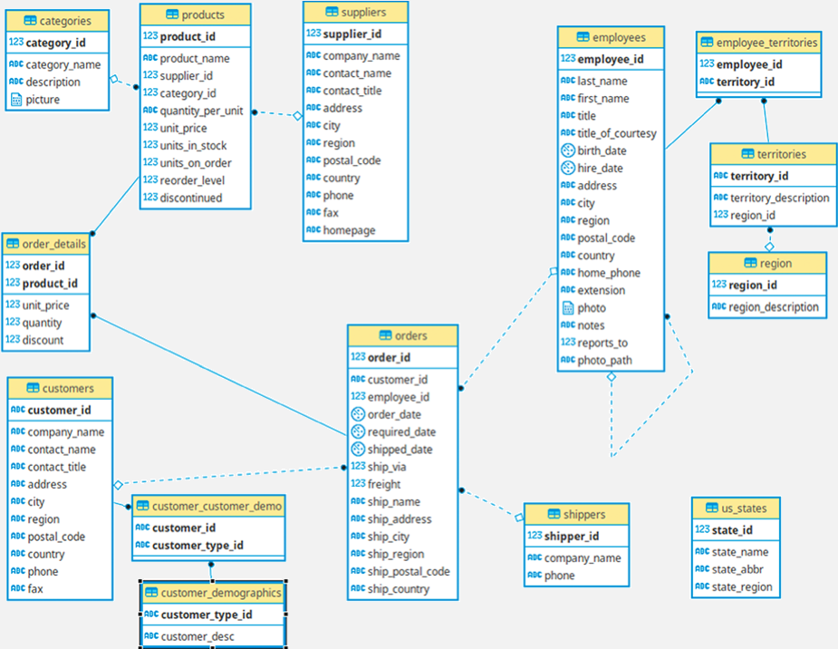

  <caption>Figura 1: Diagrama Entidade Relacionamento da base <em>Northwind</em>   Fonte: Yugabyte (2020) </caption>

Foi necessário compatibilizar a versão oficial do *Northwind* para atender as necessidades de cada sistema *NewSQL* selecionado e manter o banco com a mesma estrutura em ambas soluções. A nova estrutura pode ser acessada [aqui](codes-sql/CREATE_northwind.sql) e os dados da base [aqui](codes-sql/INSERT_northwind.sql). As alterações realizadas foram:

- Campos ***bpchar*** foram convertidos para ***varchar***;
- Campos ***bytea*** (que serviam para armazenar fotos) foram retirados;
- As chaves estrangeiras foram retiradas pois [o MemSQL não fornece suporte](https://docs.singlestore.com/v7.1/guides/use-memsql/other/mysql-features-unsupported-in-memsql/mysql-features-unsupported-in-memsql/);
- A massa de dados (*INSERT*) foi readequada para a nova estrutura.

Este tutorial irá apresentar um passo a passo que permite realizar uma prova de conceito acerca da disponibilidade dos dados em cada sistema *NewSQL* escolhido. Maiores detalhes sobre o conteúdo dessas provas de conceito são dados na [Seção 4](#praticas-sec4).

## 1.4 Recursos Utilizados

Os recursos que serão utilizados para a elaboração deste tutorial são: Docker, CockroachDB e MemSQL. O Docker é uma plataforma *open source* que fornece recursos para criar, executar, manejar e publicar containers [(MOLL, 2019)](#MOLL-2019). *Containers* são abstrações a nível de sistema operacional e se caracterizam por agrupar códigos, bibliotecas e dependências com o intuito de garantir a execução de um determinado aplicativo em um ambiente isolado do sistema *host* [(BRITO, 2020)](#BRITO-2020). A imagem de um *container* no Docker gera um pacote de *software* leve, autônomo e executável que inclui tudo o que é necessário para executar um aplicativo [(DOCKER, 2020)](#DOCKER-2020).

A finalidade de utilização do Docker neste tutorial encontra-se em abstrair especificidades relacionadas ao sistema *host* durante a instalação e utilização dos sistemas de banco de dados. Os *clusters* que servirão para as provas de conceito serão criados sob containers levando em consideração as recomendações dos desenvolvedores das ferramentas utilizadas. A versão utilizada neste tutorial será a Docker Community Edition (Docker CE, versão 19.03, gratuita).

O CockroachDB é um dos SGBDs selecionados para o tutorial. Ele é um sistema de banco de dados relacional que trabalha com linguagem *SQL*, suportada por uma *API* do PostgreSQL, capaz de fornecer escalabilidade e consistência em sistemas distribuídos. Ele também suporta transações *ACID*, além de possuir autogestão na replicação e fragmentação dos dados no *cluster*, evitando qualquer alteração manual nos dados [(COCKROACH LABS, 2020a)](#COCKROACH-2020A).

O CockroachDB é caracterizado por ser um sistema que permite o desenvolvimento de aplicações com alta disponibilidade. Seus recursos permitem manejar situações relacionadas a queda de alguns nós da infraestrutura de forma transparente, sem que a aplicação perca acesso aos dados [(PAT RESEARCH, 2020)](#PAT-2020). A versão utilizada neste tutorial é o CockroachDB Core (versão 20.1.7, gratuita), exibida na Figura 2.

  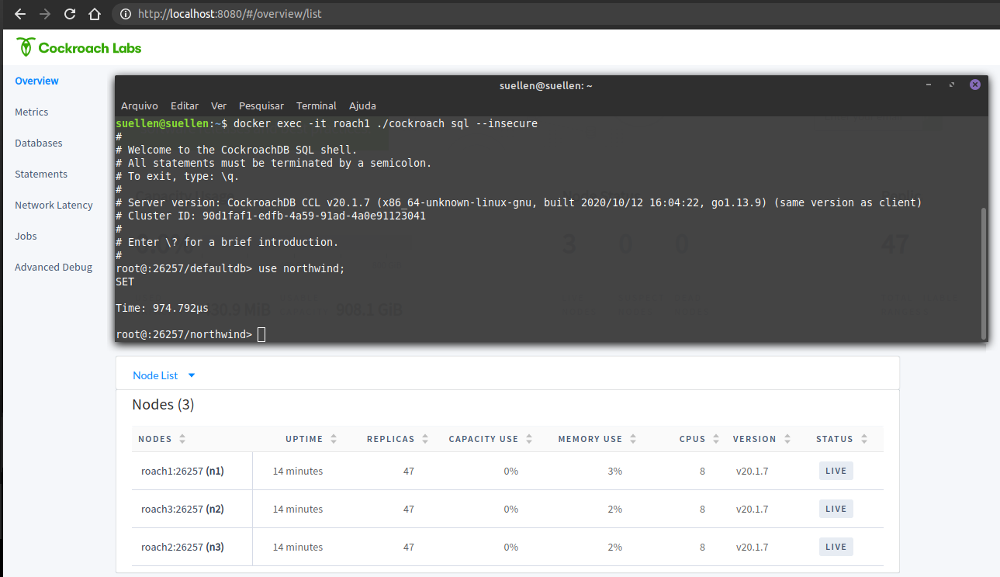

  

  <caption> Figura 2: Terminal <em>SQL</em> e ambiente de gestão do CockroachDB   Fonte: Elaborado pelos autores </caption>

O MemSQL é o segundo SGBD selecionado para o tutorial. Ele é um sistema de banco de dados relacional distribuído que lida com transações *ACID* e análises em tempo real, trabalhando com escalabilidade horizontal. Fornece suporte à sintaxe *SQL* e é compatível com o MySQL, permitindo com que aplicativos que usam de um *driver* do MySQL possam se conectar ao MemSQL de maneira transparente [(MEMSQL, 2020a)](#MEMSQL-2020A).

**Importante:** após a construção deste tutorial a empresa do MemSQL evoluiu para SingleStore. Por este motivo, alguns *links* de documentação/cadastro podem apresentar o novo nome, porém, os comandos e a versão utilizada neste tutorial permanecem como MemSQL.

O MemSQL também tem como característica chave fornecer alta disponibilidade em um sistema distribuído através do compartilhamento de cópias dos dados entre os nós do *cluster*. Desta forma, é possível perder contato com alguns nós sem deixar o sistema todo inoperante. Quanto ao funcionamento das transações, para assegurar a disponibilidade, estas são confirmadas no disco como registros de *log* e replicadas automaticamente, suportando a queda de um nó e usando dados de *logs* para recuperar as transações confirmadas [(MEMSQL, 2020a)](#MEMSQL-2020A). A versão utilizada neste tutorial é o MemSQL Software (versão 7.1, gratuita), representada na Figura 3.

  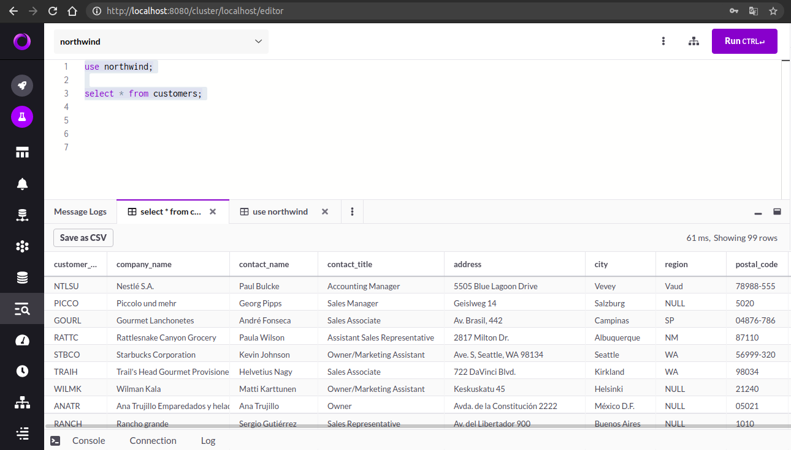

  

  <caption> Figura 3: Terminal <em>SQL</em> e ambiente de gestão do MemSQL   Fonte: Elaborado pelos autores </caption>

Tanto a escolha do CockroachDB como do MemSQL devem-se à documentação e materiais de apoio disponíveis no *site* oficial de cada sistema ([CockroachDB Labs](https://www.cockroachlabs.com/docs/stable/cockroach-commands.html) e [MemSQL Docs](https://docs.singlestore.com/v7.3/introduction/documentation-overview/)), além de serem sistemas que priorizam a disponibilidade dos dados. Outro fator que influenciou na escolha desses sistemas NewSQL foi o crescimento rápido da popularidade delas, segundo consulta ao [DB-Engines Ranking](https://db-engines.com/en/ranking_trend).

## 1.5 *Benchmarks* com CockroachDB e MemSQL

*Benchmark* (na computação) é o ato de comparar de forma eficiente e equivalente a performance entre dispositivos ou *softwares* utilizando um ou mais programas para efetuar simulações, testes padronizados e ensaios, analisando diferentes tipos de dados [(COSTA, 2020)](#COSTA-2020). Existem na literatura alguns estudos recentes que apresentam *benchmarks* com diferentes sistemas *NewSQL*. Aqui, serão comentados dois estudos identificados.

O trabalho de [Knob et al. (2019)](#KNOB-2019) compara sistemas *NewSQL*, sendo dois deles o MemSQL e CockroachDB, utilizando-se de dois *softwares* de *benchmark* (*Yahoo! Cloud Serving Benchmark - YCSB* e *Voter*) focados em transações *OLTP* (*Online Transaction Processing*) em um ambiente distribuído. Os experimentos consideraram um *cluster* de três nós físicos e as métricas avaliadas foram a taxa de transações executadas no tempo (*Throughput*) e a latência das transações, através da análise da média geral das latências. 

O YCSB gera uma carga de trabalho mista com operações de leitura e escrita, incluindo diferentes volumes de dados e número de requisições. A ferramenta realiza escolhas aleatórias, como as operações que serão feitas (*INSERT, UPDATE, SELECT*), qual registro ler ou escrever, e quantos registros examinar. Já o Voter simula a saturação de um cenário em que o sistema receberá requisições constantes, sendo cada requisição associada ao voto de uma pessoa para um determinado candidato. Ao receber uma requisição, a aplicação invoca uma transação para atualizar o número total de votos de cada participante, enquanto uma segunda transação contabiliza todos os votos. Cada teste foi configurado com um fator de escala em 1000 e com 64 usuários virtuais emulados para manipulação (64 conexões simultâneas).

O estudo de [Knob et al. (2019)](#KNOB-2019) revelou que ao analisar as médias de transações por segundo, nos dois *benchmarks*, o MemSQL foi superior ao CockroachDB, tanto em ambientes que solicitam requisições variadas como uniformes. Já os resultados sobre a latência média do CockroachDB no *benchmark* YCSB mostrou que em 99% das requisições feitas ao BD, a latência média era de quase 24 segundos, apresentando um desempenho ruim do CockroachDB quando comparado ao MemSQL. Essa discrepância não ocorreu no Voter, que trabalhou com transações menores e de apenas um tipo. Assim, o MemSQL obteve alta taxa de *throughput* e baixa latência, com diferenças consideráveis ao CockroachDB, como apresenta os resultados da Tabela 1.

  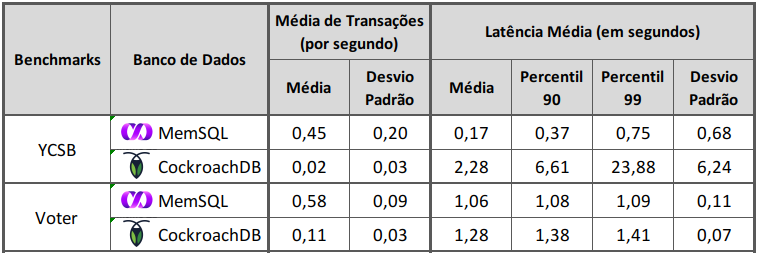
  

  

  <caption> Tabela 1: Valores obtidos nos <em>benchmarks</em>   Fonte: Adaptado de Knob et al. (2019) </caption>

O segundo estudo apresentado, desenvolvido por [Kaur e Sachdeva (2017)](#KAUR-2017), efetuou um *benchmark* com quatro sistemas *NewSQL* (entre eles o CockroachDB e o MemSQL), dedicou-se a analisar o desempenho dos SGBDs ao lidarem com operações de leitura, gravação e atualização. Cada sistema *NewSQL* foi instalado em um mesmo sistema operacional, configurados com base de dados e carga de trabalho iguais. Como parâmetros considerados para gerar uma análise comparativa, foram extraídas a latência de leitura, a latência de gravação, a latência de atualização e o tempo de execução das operações, sendo a média obtida em cada parâmetro apresentado na Tabela 2.

  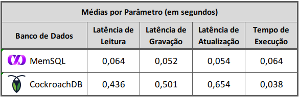
  

  

  <caption> Tabela 2: Valores obtidos no <em>benchmark</em>   Fonte: Adaptado de Kaur e Sachdeva (2017) </caption>

Novamente, o MemSQL se mostrou superior ao CockroachDB em relação aos diferentes parâmetros de latência. Inclusive, entre os demais sistemas (Volt DB e NuoDB) comparados no estudo de [Kaur e Sachdeva (2017)](#KAUR-2017), o CockroachDB foi o que apresentou as latências mais altas. O tempo de execução médio das consultas, mesmo sendo um pouco mais rápido que o MemSQL, não tira a vantagem do MemSQL, pensando no desempenho geral de cada sistema.

| :-------:
| [Voltar ao Sumário](#sumario)

# 2 Instalação das Ferramentas

Neste tópico serão abordados os passos e códigos utilizados para instalar as ferramentas utilizadas ao longo do tutorial. A seção contém informações como: *links* para tutoriais oficiais da instalação; recomendações sobre os ambientes de instalação; *prints* de tela; e informações relacionadas à configuração do ambiente.

Antes de prosseguir, informamos que os requisitos de *software* e *hardware* considerados para as instalações das ferramentas deste tutorial foram:

- sistema operacional Linux Mint 18.3
- processador Intel i5 1.6GHz
- memória RAM de 8GB 
- armazenamento interno SSD de 240GB

Esses requisitos foram viáveis de acordo com as provas de conceito [(Seção 4)](#praticas-sec4) desenvolvidas neste tutorial e, em caso de uso dos sistemas *NewSQL* em um ambiente real, é necessário consultar as documentações oficiais do [CockroachDB](https://www.cockroachlabs.com/docs/v20.2/install-cockroachdb-linux.html) e do [MemSQL](https://docs.singlestore.com/v7.3/reference/configuration-reference/cluster-configuration-reference/system-requirements/).

## 2.1 Docker

Para o tutorial de instalação do **Docker** será considerado um computador com o sistema operacional Linux Mint na versão 18.3. Informações sobre a instalação em outros sistemas operacionais podem ser consultados diretamente na documentação oficial por meio dos *links*:

- Windows: [Tutorial de instalação no Windows](https://docs.docker.com/docker-for-windows/install/);
- Mac: [Tutorial de instalação no Mac](https://docs.docker.com/docker-for-mac/install/).

**Observações importantes para Windows:** 

- O Docker para ser instalado precisa do *“Hyper - v”*, que é a virtualização do Windows;
- O Windows Home não traz este recurso, para isso é necessário: atualizar a versão; a *build*; o WSL; e instalar uma distro do Linux de sua preferência. Instruções de como realizar o procedimento estão presentes na [documentação oficial da Microsoft](https://docs.microsoft.com/en-us/windows/wsl/install-win10#step-2---update-to-wsl-2);
- Após a instalação do Docker verificar se está em um *Container* Linux, para o Windows Home os *containers* por padrão são Linux e não há como alterar, já nas demais versões a opção de outros *containers* vem habilitada; 
- Para verificar se está em um *container* Linux, com o Docker ativo, procure pelo ícone do Docker na barra de tarefas e clique com o botão direito sobre ele, se houver uma opção  *“Switch to Windows containers…”*, significa que você está no *container* Linux, se a opção for  *“Switch to Linux containers…”* (Figura 4) significa que está na opção de *containers* do Windows, e para mudar, basta clicar nesta opção;

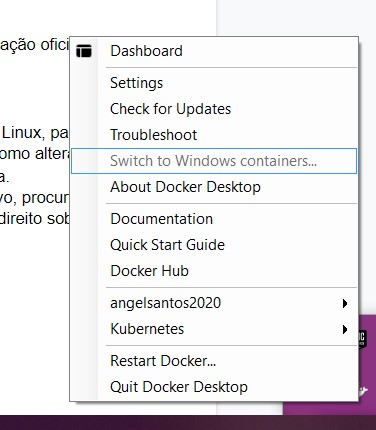

 <caption> Figura 4: <em>Switch to Linux Containers</em>   Fonte: Elaborado pelos autores  </caption>

	
- O Docker no Windows possui uma interface gráfica onde é possível realizar algumas configurações e ações nos *containers* (Figura 5) e imagens (Figura 6), porém, as ações na *interface* gráfica são limitadas. Para utilizar os recursos do Docker utilize o Power Shell;

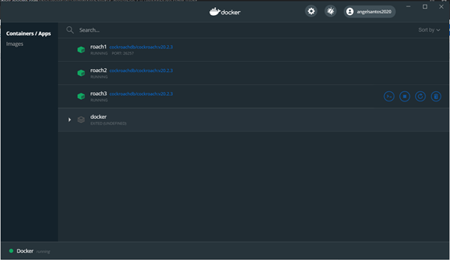

<caption> Figura 5: <em>Interface</em> gráfica do Docker com <em>Containers</em>   Fonte: Elaborado pelos autores  </caption>

	

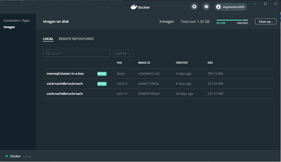

	

<caption> Figura 6: <em>Interface</em> gráfica do Docker com Imagens   Fonte: Elaborado pelos autores  </caption>

 - Todos os comandos do Docker utilizados neste capítulo podem ser reproduzidos no Windows sem o uso do comando *sudo* (comando de super usuário no Linux), para isso utilize o Power Shell e o execute como administrador, como o exemplo da Figura 7.
	

<caption> Figura 7: Acesso do PowerShell como administrador   Fonte: Elaborado pelos autores  </caption>

**Instalação no Linux:**

Antes de começar a instalação no Linux, é importante garantir que seu usuário tem permissão de administrador. Para testar se seu usuário possui permissão de administrador execute no terminal o comando `sudo -v`, se o terminal solicitar sua senha significa que você possui permissão, caso contrário será exibida uma mensagem de erro.

Após constatar que possui privilégios de administrador você deve atualizar o *cache* das listas de repositórios, para isto execute o comando `sudo apt-get update`. Pronto, privilégios checados, lista de repositórios atualizada, estamos prontos para a instalação!

Para começar a instalação devemos primeiro garantir que as dependências do instalador do Docker estão satisfeitas, estas dependências são:

- `apt-transport-https`: para permitir que o gerenciador de pacotes transfira os dados através de HTTPS;
- `ca-certificates`: habilitar o sistema a verificar certificados de segurança;
- `curl`: para transferir dados;
- `software-properties-common`: *scripts* para gerenciar o *software*.

Para instalar todos eles ao mesmo tempo podemos executar apenas um comando: `sudo apt-get install  curl apt-transport-https ca-certificates software-properties-common`. Não se preocupe em analisar se estes *softwares* já estão presentes no seu sistema, o `APT-GET` é inteligente e não irá baixar pacotes que já estão instalados, e caso a versão instalada seja antiga ele irá atualizar ;).

A instalação oficial do Docker não está presente nas listas básicas de aplicativos do Linux. Mas isto não é motivo para preocupação, com apenas duas linhas de código já seremos capazes de acessar o repositório oficial. 

**Atenção:** Os comandos aqui mencionados foram configurados para funcionar em Linux Ubuntu e derivados. Os comandos foram testados com sucesso na versão 18.3 do Linux Mint, para outras versões do Linux (inclusive do Mint) podem ser necessárias alterações nas *URLs*. Isto se deve ao fato de que cada distribuição ter um instalador específico, sendo que o nome e a versão da distribuição fazem parte da *URL* para indicar o caminho do *download*. A lista das versões e distribuições suportadas pelo instalador do Docker podem ser consultadas [aqui](https://download.docker.com/linux).

O primeiro passo é adicionar a chave CPG oficial do Docker para garantir a segurança enquanto baixamos os arquivos do repositório oficial, o comando é este: `curl -fsSL https://download.docker.com/linux/ubuntu/gpg   sudo apt-key add -`.

Após adicionada a chave agora vamos adicionar o repositório da última versão estável do Docker em nossas lista através do comando: `sudo add-apt-repository "deb [arch=amd64] https://download.docker.com/linux/ubuntu $(lsb_release -cs) stable"`. Como acabamos de adicionar um novo repositório em nossas listas, devemos atualizar novamente o *cache* com o comando `sudo apt-get update`.

Chegou a hora esperada: instalar o *docker-ce*. Para isto basta executar o comando: `sudo apt install docker-ce`. Após concluir o processo de instalação (que é todo automatizado) podemos confirmar se o Docker está ligado através do comando: `sudo systemctl status docker`, caso tenha ocorrido tudo bem devemos observar uma mensagem igual a da Figura 8.

<caption> Figura 8: Mensagem de ativação do Docker no Linux   Fonte: Elaborado pelos autores  </caption>

Neste ponto estamos habilitados a seguir com as instalações, pois nosso Docker está instalado e operante :D.

## 2.2 CockroachDB

Todas as versões do CockroachDB são distribuídas em formato binário, isto significa que não há um instalador. Para utilização do CockroachDB basta fazer o *download* dos arquivos para o sistema operacional utilizado, extrair em uma pasta e executar o sistema. Para este tutorial iremos utilizar a versão do sistema que funciona sobre *container* Docker, para isto utilizaremos a imagem distribuída oficialmente pelo fabricante através do Docker Hub.

Tendo o Docker já instalado, basta executar o comando `sudo docker pull cockroachdb/cockroach:v20.1.9`. Este comando irá verificar se esta imagem já existe em seu computador, caso não exista ele fará o *download*. Não é necessário mais nenhum passo para a instalação, a utilização desta imagem será abordada na criação do *cluster* utilizando o CockroachDB [(Seção 3.1.2)](#cockroachdb-sec3a), onde criaremos um *container* utilizando a imagem que acabamos de baixar, para cada nó da nossa arquitetura.

## 2.3 MemSQL

O MemSQL é um sistema pago e para a ocasião deste tutorial iremos utilizar uma licença gratuita que possui limitações de uso, porém, servirá para nosso propósito de prova de conceito. Antes de iniciar a instalação é preciso criar uma conta para obter uma chave de acesso para a versão gratuita. O cadastro deve ser feito por meio [deste link](https://www.singlestore.com/free/).

A versão grátis do MemSQL trata-se de apenas um *container* Docker onde podem ser executadas instâncias do SGBD. A fabricante chama esta instalação de *"cluster-in-a-box"* pois toda a configuração da aplicação acontece de forma automática dentro do *container* e o usuário não precisa interferir (caixa preta) para que o básico funcione.
Para instalar o MemSQL basta criar um arquivo de configuração com informações básicas para que o Docker faça todo o trabalho, este arquivo é o `docker-compose.yaml` e ele deve conter este conteúdo:

~~~docker-compose.yaml
version: '2'

services:
  memsql:
    image: 'memsql/cluster-in-a-box'
    ports:
      - 3306:3306
      - 8080:8080
    environment:
      LICENSE_KEY: <sua chave de acesso deve ser colocada aqui>
      ROOT_PASSWORD: <coloque uma senha aqui>
      START_AFTER_INIT: 'Y' 
~~~

Para entender melhor os passos que serão executados de forma automática pelo Docker faremos uma breve explicação do conteúdo deste arquivo:

- A *tag* `services` contém toda informação relacionada ao *container* que o Docker deve configurar, neste caso o Docker irá criar um *container* chamado `memsql` que utilizará a imagem `memsql/cluster-in-a-box` presente no Docker Hub;
- A *tag* `ports` faz um mapeamento entre as portas do *container* e do computador *host*, sendo a primeira porta relativa ao *host* e a segunda ao *container*. Por exemplo, o comando `80:8888` indica que a porta 8888 do *container* será mapeada para a porta 80 do computador *host*. O arquivo .yaml está fazendo um redirecionamento direto utilizando as mesmas portas para *container* e *host*, agora com o entendimento de como funciona você será capaz de manejar estas portas caso elas já estejam em uso no *host*, mantendo atenção para alterar apenas o 1º parâmetro;
- A *tag* `LICENSE_KEY` deve conter a chave de acesso que conseguimos ao se cadastrar no *site* oficial. Em um ambiente real de uso não é recomendado manter a chave de acesso salva no arquivo por questões de segurança, neste casos é recomendado utilizar as "variáveis de ambiente". Para mais informações sobre este tipo de utilização pode ser conferida na [documentação oficial](https://docs.singlestore.com/v7.1/guides/use-memsql/develop/getstarted/free/);
- A *tag* `ROOT_PASSWORD` contém a senha que será utilizada para acessar as funcionalidades do sistema, portanto, escolha uma senha simples para ser configurada, uma vez que estamos em um ambiente de teste ;) ;
- A *tag* `START_AFTER_INIT` é apenas uma garantia para que o *container* não se desligue durante a utilização.

Ao executar o `docker-compose.yaml` o Docker pode criar alguns arquivos ocultos no local onde o arquivo se encontra, por isso é recomendado salvar este arquivo em uma pasta específica para o MemSQL. Após criar a pasta e salvar o arquivo, o processo de instalação está concluído. 

**Atenção**: 
- O *download* da imagem oficial do Docker Hub só vai acontecer na primeira inicialização do *cluster* que será descrita na [Seção 3.2.2](#memsql-sec3b) ao criar o *cluster* do MemSQL;
- O sistema exige ao menos 10GB livres no HD para poder iniciar, ele **não** irá ocupar todo este espaço, mas é um requisito para criar o *cluster*.

| :-------:
| [Voltar ao Sumário](#sumario)

# 3 Criação do *Cluster* Utilizando o Docker

## 3.1 CockroachDB

### 3.1.1 Topologia do *Cluster*

Para a criação do *cluster* utilizaremos três *containers* do CockroachDB e que terão as seguintes responsabilidades:

- O primeiro *container*, denominado *roach1*, será o *agregador*. Ele irá gerenciar a comunicação entre os outros dois *containers* que serão criados;
- O segundo e o terceiro *container* serão os *Leaves*, cada um será criado em um *container* individual, sendo eles o *roach2* e *roach3*, respectivamente.

Ao final será formada a topologia abaixo, como mostra o diagrama da Figura 9.

  	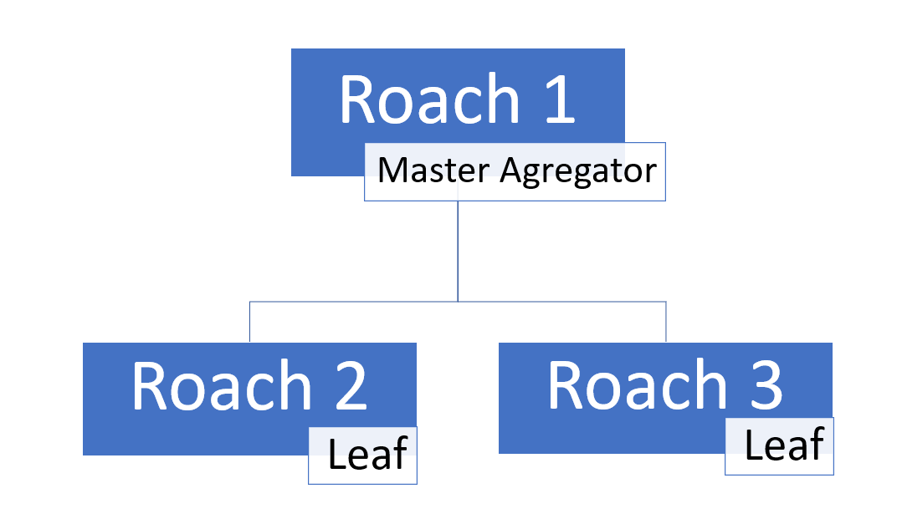

<caption> Figura 9: Topologia do <em>cluster</em> no CockroachDB   Fonte: Elaborado pelos autores </caption>

### 3.1.2 Criação do *Cluster*

Para criar o *cluster* com o CockroachBD será necessário criar três *containers*, cada um terá uma instância do banco de dados e representará um computador diferente. A comunicação entre os *containers* acontecerá por meio de uma rede interna do Docker, e este será o primeiro passo para criar o *cluster*. Para criar a rede devemos executar o comando: 

`docker network create -d bridge roachnet`.

Este comando irá criar, no ambiente do Docker, uma rede chamada ***roachnet***. Isto significa que apenas os *containers* podem ver e usar essa rede, exatamente como uma rede local. O nome *roachnet* é arbitrário e pode ser alterado conforme seu gosto, basta recordá-lo pois iremos utilizá-lo nos próximos comandos.

Para organizar os arquivos do Docker devemos criar uma pasta chamada *“cockroach-data”*. Dentro desta pasta devemos criar outras três, uma para cada *container* que iremos inicializar, sendo: *“roach1”*, *“roach2”* e *“roach3”*. **Dica:** crie esta pasta em um diretório com o caminho pouco complexo, pois nos próximos comandos nós iremos escrever este endereço.

Para iniciar o primeiro *container* iremos executar no terminal o seguinte comando:

~~~docker
docker run -d \
--name=roach1 \
--hostname=roach1 \
--net=roachnet \
-p 26257:26257 -p 8080:8080  \
-v "rota_para_a_pasta/cockroach-data/roach1:/cockroach/cockroach-data"  \
cockroachdb/cockroach:v20.1.7 start \
--insecure \
--join=roach1,roach2,roach3
~~~

**Explicação:**

- O `docker run` indica que um *container* deve ser iniciado e, caso ele não exista, será criado;
- A *flag* `name` é a identificação do *container* que será criado, ela pode ser alterada, porém, existem outras referências para este nome, caso queira colocar outro nome tenha isto em mente e atualize todas as referências;
- O `hostname` serve para a identificação da rede interna durante a sua configuração;
- A *flag* `net` faz referência a rede na qual nosso *container* irá se conectar, no caso do exemplo, vamos nos conectar na ***roachnet*** que foi criada nos passos anteriores. Caso você tenha alterado o nome da rede no passo anterior **atenção aqui**;
- As *flags* `p` indicam o redirecionamento de portas do *host:container* que, no geral, não precisam ser alteradas. Lembrando que as portas relacionadas ao *container* (2º parâmetro) não devem ser alternadas;
- A *flag* `-v` é um direcionamento entre uma pasta existente dentro do *container* e uma pasta no computador *host*. Isto é necessário pois o *container* não tem um armazenamento permanente e todos os dados são apagados quando o *container* desliga. Os dados salvos nesta pasta ficarão salvos no computador *host* e serão usados pelo *container*;
- O comando `cockroachdb/cockroach:v20.1.9 start` irá iniciar, dentro do *container* recém criado, a imagem que fizemos o *download* na [Seção 2.2](#cockroachdb-sec2b);
- A *flag* `insecure` faz parte da implementação voltada ao teste do CockroachDB, ela **não deve ser alterada**;
- Uma das *tags* mais importantes é a `join`, ela irá indicar quais *containers* devem se conectar dentro da rede local do Docker, no caso do exemplo os *containers* de *hostname* *roach1*, *roach2* e *roach3* serão conectados.

Após executar este comando teremos o *container* principal ativo, porém, ainda faltam os nós que compõem a estrutura básica do CockroachDB. Após entender bem a estrutura do comando que inicia o *container* principal podemos notar que para iniciar outro *container* só precisamos mudar o: `name`, `hostname`, e a pasta da *flag* `v`. Como a conexão da máquina *host* será realizada apenas com o *container* principal, os outros *containers* (nós) não precisam de configuração de portas, a rede local do Docker basta.

Então, para subir o *container* **roach2**, execute:

~~~docker
docker run -d \
--name=roach2 \
--hostname=roach2 \
--net=roachnet \
-v "rota_para_a_pasta/cockroach-data/roach2:/cockroach/cockroach-data"  \
cockroachdb/cockroach:v20.1.7 start \
--insecure \
--join=roach1,roach2,roach3
~~~

E para o *container* **roach3**, execute:

~~~docker
docker run -d \
--name=roach3 \
--hostname=roach3 \
--net=roachnet \
-v "rota_para_a_pasta/cockroach-data/roach3:/cockroach/cockroach-data"  \
cockroachdb/cockroach:v20.1.7 start \
--insecure \
--join=roach1,roach2,roach3
~~~

Após executar estes comandos com sucesso teremos três *containers* ligados, cada um rodando uma instância do CockroachDB. Para inicializar o *cluster* basta executar o comando: 

`docker exec -it roach1 ./cockroach init --insecure`

Este comando irá iniciar o sistema do CockroachDB dentro do *container* **roach1** e toda a configuração restante acontecerá automaticamente. Neste ponto teremos um *cluster* de CockroachDB ativo, onde o *container* **roach1** é o principal e os outros são seus nós secundários :).

**Recordando**: Cada *container* é uma instalação única do CockroachDB. O único *container* que tem comunicação aberta com a máquina *host* é o “roach1”. Os dados utilizados pelo banco (incluindo os binários que salvam as informações armazenadas dentro do banco) serão salvos na pasta atrelada à *tag* `v`. A comunicação entre *containers* é feita via rede interna do Docker.

Para criar a base de dados *Northwind* vamos utilizar um terminal *SQL* do CockroachDB. Para acessá-lo devemos abrir um terminal Linux e executar o seguinte comando:

`docker exec -it roach1 ./cockroach sql --insecure`

Após executar este comando nós teremos acesso ao terminal *SQL* dentro do *container* **roach1**, como mostra a Figura 10.

  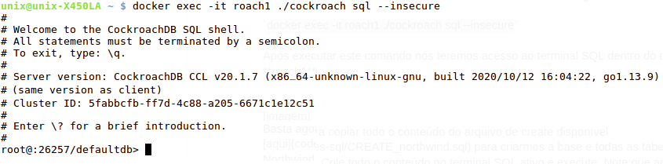

  

  <caption> Figura 10: Terminal do CockroachDB   Fonte: Elaborado pelos autores </caption>

Basta copiar todo o conteúdo do arquivo de *create* [**disponível aqui**](codes-sql/CREATE_northwind.sql) para criarmos a base e todas as tabelas do BD *Northwind*. Cole todo o conteúdo no terminal *SQL* ativo, ao colar pode parecer que apenas os últimos comandos foram copiados, isto acontece por conta da quantidade de linhas copiadas e ele acaba não mostrando o começo, mas pode executar normalmente que o banco será criado. Note que ao executar as instruções, o CockroachDB emite o tempo de execução de cada comando, como no exemplo da Figura 11. Aguarde todos os comandos serem executados para prosseguir.

  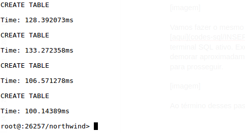

  <caption> Figura 11: Saídas via terminal do CockroachDB   Fonte: Elaborado pelos autores </caption>

Vamos fazer o mesmo com o arquivo de *insert* disponível [aqui](codes-sql/INSERT_northwind.sql), copiando todo o seu conteúdo e colando no terminal *SQL* ativo. Execute as instruções e aproveite para tomar um café…essa ação pode demorar aproximadamente 15 minutos. Aguarde todos os comandos serem executados para prosseguir.

Ao término desses passos, nossa base de dados está criada e pronta para uso. ;) 

Os comandos aqui contidos para criação de *containers* são para Linux, caso necessite realizar a criação no Windows ou Mac acesse a [documentação](https://www.cockroachlabs.com/docs/v20.2/start-a-local-cluster-in-docker-windows) e escolha seu sistema operacional.

**Atenção:** Antes de prosseguir para a seção seguinte, **não se esqueça de desativar o *cluster* do CockroachDB** para fazermos a instalação do MemSQL. Para isso, abra um terminal Linux e execute o comando `docker stop roach1 roach2 roach3`. Aguarde o nome dos *containers* serem retornados como saída.

## 3.2 MemSQL

### 3.2.1 Topologia do *Cluster*

Para criação do *cluster* utilizaremos cinco instâncias do MemSQL, elas terão as seguintes responsabilidades:

- A primeira instância será o *agregador* e será identificada pela porta 3306, sua função será gerenciar as conexões entre as outras quatro que serão criadas;
- A segunda e a terceira instância serão *Leaves*, elas pertencerão ao grupo 1 e serão identificadas pelas portas 3307 e 3308, respectivamente;
- A quarta e quinta instância serão *Leaves* réplicas do grupo 1, elas pertencerão ao grupo 2 e serão identificadas pelas portas 3309 e 3310, respectivamente.

Ao final será formada a topologia a seguir, como mostra o diagrama da Figura 12.

  	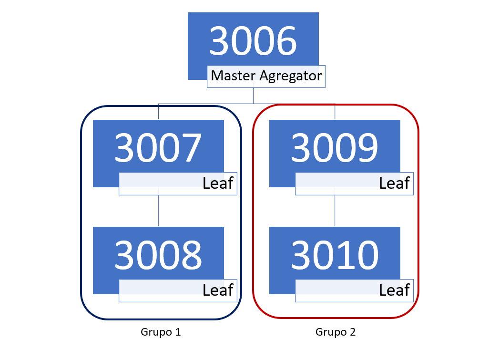

<caption> Figura 12: Topologia do <em>cluster</em> no MemSQL  Fonte: Elaborado pelos autores </caption>

### 3.2.2 Criação do *Cluster*

A criação do *cluster* básico utilizando o MemSQL acontece de forma transparente para o usuário. Para iniciar o processo é necessário abrir o terminal e navegar até a pasta onde o arquivo *“docker-compose.yaml”* foi salvo, após acessar a pasta executar o comando: `docker-compose up`. Ao executar este comando o Docker irá vasculhar a pasta atual por um arquivo *“docker-compose.yaml”* e quando encontrar irá executá-lo. Neste ponto todos os comandos escritos no arquivo `docker-compose.yaml` serão executados. Caso seja a primeira execução é neste ponto que a imagem do sistema será baixada do Docker Hub.

Se ao executar o comando  o sistema indicar que o `docker-compose up` não é um comando reconhecido, é necessário instalar o módulo de *docker compose*. Acesse a  [documentação](https://docs.docker.com/compose/install/) e siga as instruções referente ao seu sistema operacional.

Após executar o *docker-compose up* com sucesso o *cluster* básico já estará em execução, porém, ainda precisamos executar alguns comandos pois a estrutura básica é formada de apenas um nó agregador e um nó secundário e isto não é suficiente para ativar a alta disponibilidade. O MemSQL distribui partições de dados por todos os nós existentes, e desta forma caso um nó fique *offline* o sistema para de responder com o intuito de garantir a integridade. Para ativar a alta disponibilidade é necessário criar dois grupos com a mesma quantidade de nós para que o algoritmo do SGBD possa distribuir e replicar as partições da base de dados para o sistema continuar disponível em caso de queda de alguns nós (caso um nó e sua réplica fiquem *offline*, inevitavelmente o sistema ficará indisponível).

Para o tutorial nós iremos criar dois grupos compostos por dois nós cada, a estrutura básica já criou um nó e ele faz parte do grupo 1, então o próximo passo será criar e registrar mais um nó. Este nó será automaticamente registrado no grupo 1, pois ainda não indicamos para o sistema que vamos montar uma estrutura de alta disponibilidade.

**Atenção:** os nós são criados dentro do mesmo *container*, então sua identificação é feita com base na porta que ele estará disponível. A estrutura básica criou o nó agregador na porta 3306 e o nó secundário na porta 3307.

Para criar um nó devemos executar no terminal o seguinte comando (lembrando que o comando pedirá confirmação de execução):
`docker exec -it **nome_do_container** memsqlctl create-node --password "" --port XXXX`

**Explicação:**

- **nome_do_container** representa a identificação atribuída ao *container* pelo Docker que, geralmente, fica como “memsql_memsql_1”. Para confirmar basta executar um `docker ps` e observar a coluna `NAMES`;
- **XXXX** deve ser substituído por uma porta disponível. É importante anotar a porta utilizada pois ela servirá de referência para nossos comandos de manipulação sobre os nós. Para criar o segundo nó do grupo 1 recomendamos utilizar a porta 3308.

Após criar o nó 3308, nós devemos registrá-lo no agregador. Para registrar nós no agregador é necessário executar o comando (novamente, o comando pedirá confirmação de execução):
`docker exec -it **nome_do_container** memsqlctl add-leaf --host '127.0.0.1' --port XXXX`

Neste ponto nossa estrutura está composta por um agregador e dois nós secundários no grupo 1. Podemos visualizar esta estrutura através do comando *SQL* `SHOW LEAVES`, porém, para executar comandos *SQL* é necessário primeiro acessar a interface gráfica. Acesse [http://localhost:8080](http://localhost:8080) no navegador e selecione a opção *“Localhost”*. No campo usuário informe *“root”* e como senha o valor configurado em ROOT_PASSWORD que foi criado no arquivo *“docker-compose.yaml”*. Assim, nós iremos acessar toda a área administrativa da aplicação via MemSQL Studio (modo gráfico), como apresenta a Figura 13.

  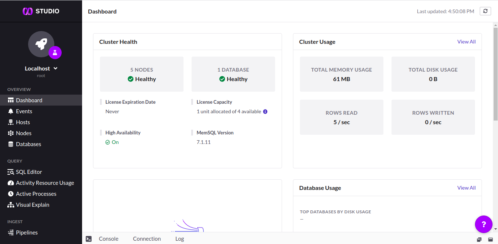

  

  <caption> Figura 13: Ambiente gráfico do MemSQL (MemSQL Studio)   Fonte: Elaborado pelos autores </caption>

Para executar comandos *SQL* basta acessar o item *“SQL Editor”* no menu esquerdo. Na Figura 14 podemos ver o resultado do comando `SHOW LEAVES;` mostrando a estrutura atual do nosso *cluster*, composto de dois nós secundários no grupo 1.

  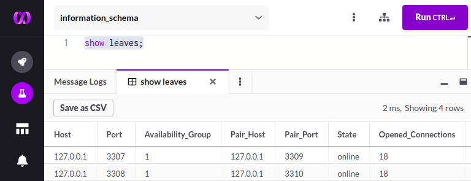

  

  <caption> Figura 14: Nós no grupo 1 do <em>cluster</em> do MemSQL   Fonte: Elaborado pelos autores </caption>

Para incluir nós no grupo 2 precisamos informar ao algoritmo do banco que estamos montando uma estrutura de alta disponibilidade, e isto deve ser feito através do seguinte comando *SQL*:
`SET @@GLOBAL.redundancy_level = 2;`

Após executar este comando no *”SQL Editor”* todos os novos nós registrados serão automaticamente alocados no grupo 2. Agora basta repetir o processo de criar e registrar nós, porém, criando os nós nas portas 3309 e 3310, respectivamente. Após concluir a criação dos nós teremos então uma estrutura de alta disponibilidade formada por um nó agregador e quatro nós secundários divididos em dois grupos, onde o grupo 2 é uma réplica do grupo 1. Isso pode ser consultado ao replicar o comando `SHOW LEAVES;`, como no exemplo da Figura 15.

  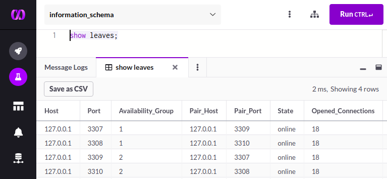

  

  <caption> Figura 15: Nós do grupo 1 e grupo 2 do <em>cluster</em> do MemSQL   Fonte: Elaborado pelos autores </caption>

Para criar e popular a base de dados *Northwind* utilizaremos novamente o *“SQL Editor”*. Basta agora copiar todo o conteúdo disponível [aqui](codes-sql/CREATE_northwind.sql) para criarmos a base e todas as tabelas do *Northwind*. Cole todo o conteúdo no *“SQL Editor”*, mantenha todo o código selecionado e execute-o (Figura 16). Note que ao executar as instruções, o MemSQL mostra uma aba como “saída” para cada tabela criada. Aguarde todos os comandos serem executados para prosseguir.

  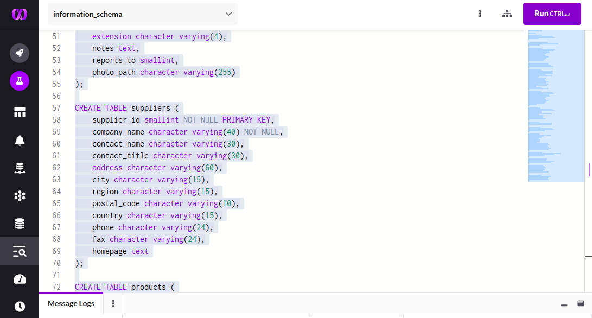

  

  <caption> Figura 16: <em>SQL Editor</em> do MemSQL Studio com comandos de <em>INSERT</em>   Fonte: Elaborado pelos autores </caption>

Vamos fazer o mesmo com [o arquivo dos inserts](codes-sql/INSERT_northwind.sql), copiando todo o seu conteúdo e colando no *“SQL Editor”* do MemSQL. Mantenha todo o código selecionado e execute-o. Aproveite para tomar mais um café…. essa ação pode demorar aproximadamente 15 minutos. Aguarde todos os comandos serem executados para prosseguir.

Ao término desses passos, nossa base de dados está criada e com todos os dados prontos para uso ;) 

**Atenção:** Antes de prosseguir para a seção seguinte, **não se esqueça de desativar o *cluster* do MemSQL e ativar o *cluster* do CockroachDB**. Para isso, abra um terminal Linux, execute o comando `docker stop memsql_memsql_1` e aguarde o nome do *container* ser retornado como saída. Em seguida, execute `docker start roach1 roach2 roach3` e aguarde o nome dos *containers* serem retornados como saída.

| :-------:
| [Voltar ao Sumário](#sumario)

# 4 Trabalhando com a Disponibilidade: Práticas e Resultados

Para realizar uma prova de conceito em cada um dos sistemas *NewSQL* apresentados, foram desenvolvidas instruções *SQL* que atendem a três tipos de comandos, sendo eles de escrita-escrita, leitura-escrita e leitura-leitura. Escrita-escrita é relacionado a comandos *INSERT* que efetuam a gravação de um novo registro na base de dados, leitura-escrita inclui instruções como *UPDATE* (para atualizar) e *DELETE* (para apagar) um registro existente em banco, e leitura-leitura é associado aos comandos *SELECT* para selecionar dados de uma ou mais tabelas. Para manter um padrão na quantidade de comandos, foram desenvolvidas 20 instruções para cada um dos tipos mencionados, gerando assim um total de 60 comandos.

A base de dados *Northwind* possui 14 tabelas no total (como mostrado na [Seção 1.3](#contexto-sec1c)), porém, vale ressaltar que os comandos apresentados para a prática destinam-se apenas às tabelas *“customers”* e *“orders”* (Figura 17). As instruções foram limitadas a estas duas tabelas justamente para ser possível avaliar resultados acerca da disponibilidade fornecida por diferentes sistemas *NewSQL* que foram submetidos ao mesmo conteúdo de prova.

  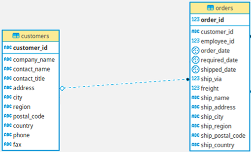

  

  <caption> Figura 17: Tabelas <em>customers</em> e <em>orders</em> do banco <em>Northwind</em>   Fonte: Yugabyte (2020) </caption>

Os 60 comandos da prova de conceito prática são divididos em dois conjuntos (Grupo A e Grupo B), com 30 instruções cada. Essa divisão também distribui igualmente a variedade de comandos por tipo em cada grupo. Ou seja, cada grupo possui 10 comandos de escrita-escrita, mais 10 instruções de leitura-escrita e outros 10 comandos de leitura-leitura, organizados de maneira intercalada. Cada grupo de comandos precisa ser executado na mesma ordem, respeitando a sequência em que são apresentados neste tutorial.

Diante desta introdução, siga os procedimentos dados em cada estudo de caso a seguir. Após o passo a passo efetuado em cada estudo, este tutorial abordará sobre alguns resultados obtidos na aplicação dos comandos, respectivos à disponibilidade dos dados.

## 4.1 Estudo de caso com o CockroachDB

- **Passo 1:** Com o CockroachDB ativo com 3 nós em seu *cluster* e com o banco de dados *Northwind* pronto para uso, retorne para o terminal *SQL*.   Caso você tenha fechado esta tela, execute novamente a instrução `docker exec -it roach1 ./cockroach sql --insecure` em um terminal Linux e, na sequência, aplique um `USE northwind;`  Dentro do terminal *SQL* e do BD *Northwind* **execute os comandos do Grupo A de uma só vez, [os comandos do Grupo A podem ser encontrados aqui](codes-sql/GRUPOA_comandos.sql)**

Observe as saídas emitidas pelo sistema. Se o CockroachDB permitir a execução dos comandos e tudo correr como esperado, o CockroachDB vai emitir o tempo de execução de cada comando. O retorno apresentado após a última instrução será semelhante ao mostrado na Figura 18.

  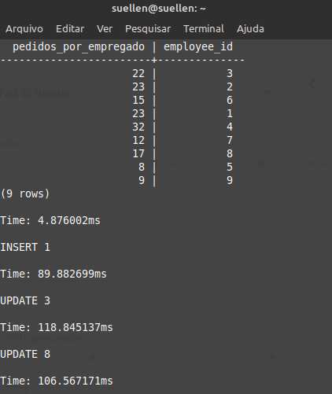
  

  

  <caption> Figura 18: Exemplos de saídas após executar os comandos   Fonte: Elaborado pelos autores </caption>

Observe saídas respectivas ao tempo de execução das instruções, uso de *hardware* e outras métricas ao acessar [http://localhost:8080](http://localhost:8080) no seu navegador. Ele dará acesso ao *Cockroach Labs*, ambiente gráfico do CockroachDB, como no exemplo da Figura 19. Para alterar a visualização dos tipos de gráficos, basta acessar as áreas destacadas em verde na imagem.

  
 

  

  <caption> Figura 19: Exemplos de gráficos obtidos via Cockroach Labs   Fonte: Elaborado pelos autores </caption>

- **Passo 2:** Agora vamos **forçar a queda de um dos nós secundários do nosso *cluster*** no CockroachDB. Para isso, acesse um segundo terminal Linux e aplique o comando `docker stop roach2`. Execute o comando e aguarde o nome do *container* ser mostrado na tela como retorno, como na Figura 20.

  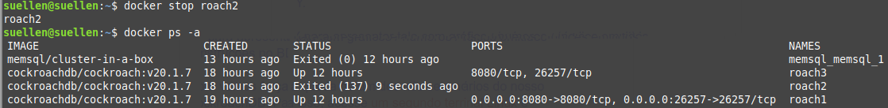
 

  

  <caption> Figura 20: Desativando um nó no <em>cluster</em> do CockroachDB   Fonte: Elaborado pelos autores </caption>

Para confirmar se o sistema está operando apenas com dois nós, execute a instrução `docker ps -a` para listar os *containers* no Docker. Se apenas o *roach2* aparecer com o *status* como ***Exited*** e os demais *containers* do CockroachDB como ***Up***, quer dizer que tudo está ok.

- **Passo 3:** Com esta nova configuração do *cluster*, vamos executar nosso segundo grupo de comandos (Grupo B).   Novamente, retorne ao terminal *SQL*, **[acesse os comandos do Grupo B aqui](codes-sql/GRUPOB_comandos.sql) e execute as instruções do Grupo B de uma só vez.**  

Observe as saídas emitidas pelo sistema, semelhantes a Figura 21. Se o CockroachDB fornecer uma mensagem semelhante ao retorno obtido no Passo 1, então quer dizer que mesmo com 2 nós em atividade o sistema manteve-se disponível. Caso queira observar outras métricas (gráficos) via Cockroach Labs, retorne ao [http://localhost:8080](http://localhost:8080).

  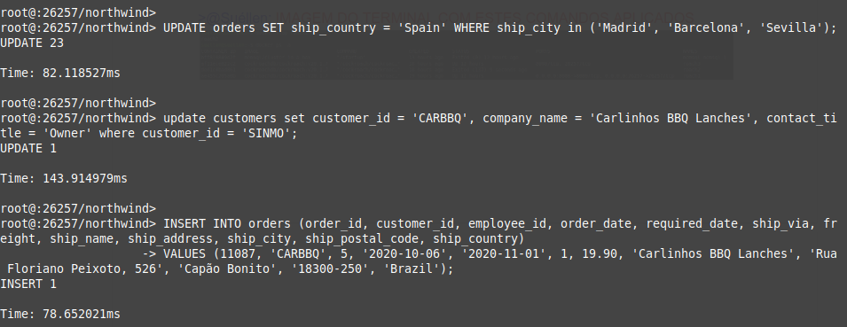
  

  

  <caption> Figura 21: Exemplos de saídas após executar os comandos   Fonte: Elaborado pelos autores </caption>

**Observação:** Caso um nó crítico seja desativado, ao executar o Grupo B de comandos o seu terminal ficará em espera e irá aguardar até o *cluster* se recuperar. Isso representa que o sistema não conseguiu fornecer disponibilidade pois alguma informação essencial não está presente nos nós ativos e, assim, o mesmo para de responder para evitar falhas de integridade. 

Em breve, uma avaliação deste resultado será feita na [Seção 4.3](#resultados-sec4c).

**Atenção:** Antes de prosseguir para a seção seguinte, **não se esqueça de desativar o *cluster* do CockroachDB e ativar o do MemSQL**. Para isso, abra um terminal Linux, execute o comando `docker stop roach1 roach2 roch3` e aguarde o nome de todos os *containers* aparecerem na saída do terminal. Em seguida, execute `docker start memsql_memsql_1` e aguarde o nome do *container* ser exibido.

## 4.2 Estudo de caso com o MemSQL

- **Passo 1:** Com o **MemSQL ativo com 5 nós em seu *cluster* e com o banco de dados *Northwind*** pronto para uso, retorne ao MemSQL Studio aberto em seu navegador via [http://localhost:8080](http://localhost:8080).   Dentro do MemSQL Studio acesse a opção *SQL Editor* no menu lateral e na área em branco aplique o comando `USE northwind;` para ser executado, clicando em *Run CTRL*, como mostra os destaques em verde na Figura 22.

  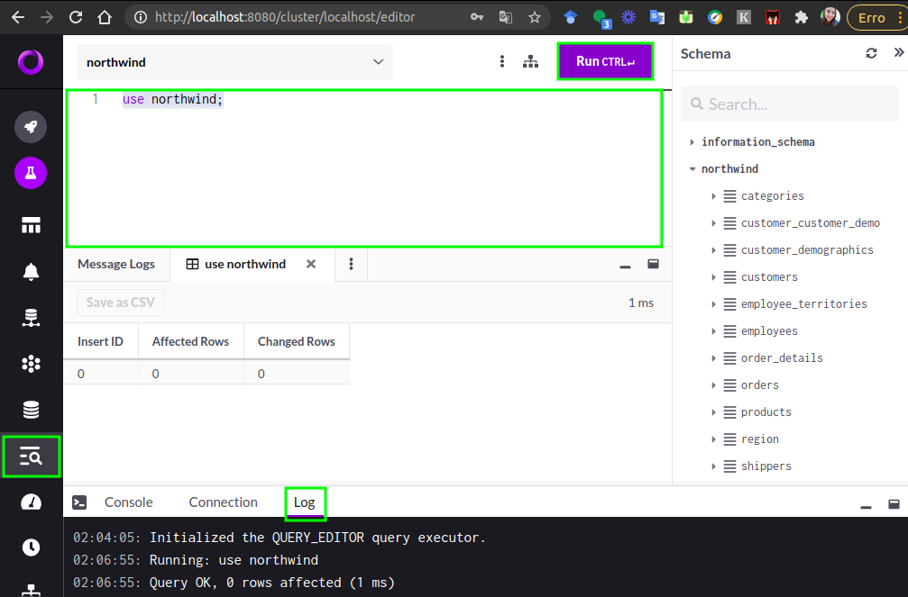
  

  

  <caption> Figura 22: Localização do <em>SQL Editor</em> no MemSQL Studio   Fonte: Elaborado pelos autores </caption>

Na área do *SQL Editor*, **execute de uma só vez os [comandos do Grupo A disponíveis aqui](codes-sql/GRUPOA_comandos.sql))**.  Para isso, deixe todos os comandos selecionados antes de clicar em *Run CTRL*.

Observe as saídas emitidas pelo sistema. Se o MemSQL permitir a execução dos comandos e tudo correr como esperado, o MemSQL vai emitir o tempo de execução de cada comando, via *Log*, opção localizada na área inferior da tela. O retorno apresentado após a última instrução será semelhante ao mostrado na Figura 23.

  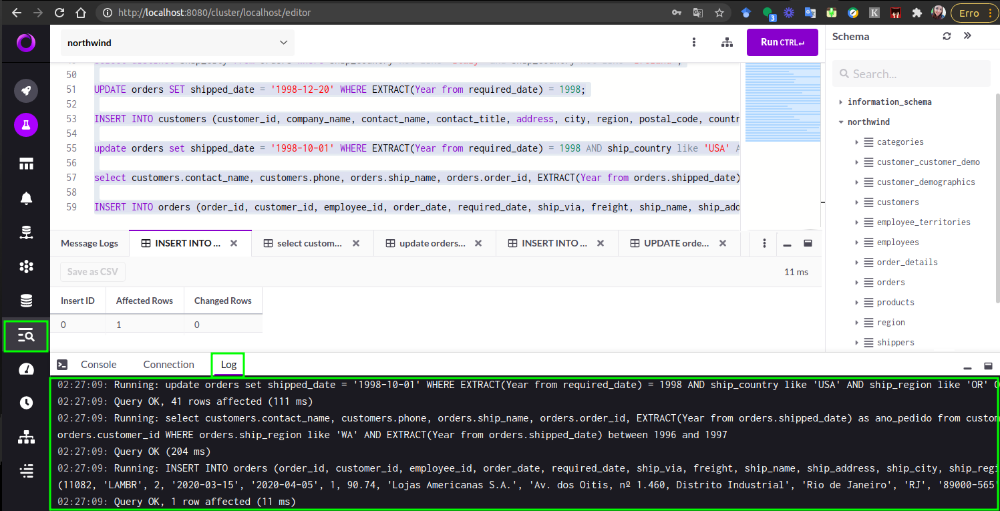
  

  

  <caption> Figura 23: Exemplos de saídas após executar os comandos   Fonte: Elaborado pelos autores </caption>

- **Passo 2:** Agora vamos **forçar a queda de um dos nós secundários (*Leaf*) do nosso *cluster*** no MemSQL. Para isso, no *SQL Editor* clique no botão *Console* na área inferior da tela do MemSQL Studio. Acesse a opção *Nodes* no menu lateral para ver todos os nós ativos e, com o *Console* ainda aberto, execute o comando `DETACH LEAF '127.0.0.1':3307;`. Aguarde ele confirmar a operação, como nas marcações em verde da Figura 24.

  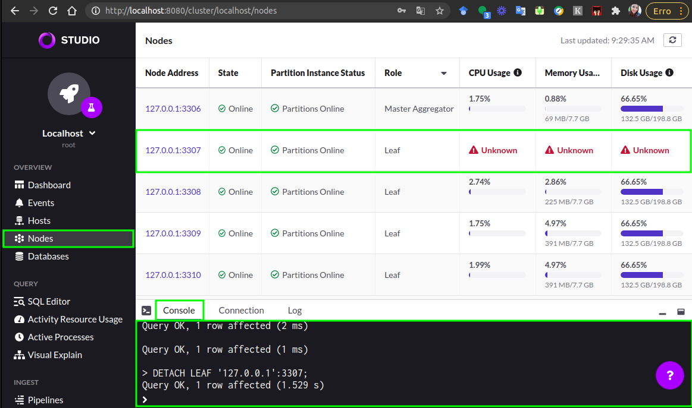
 

  

  <caption> Figura 24: Desativando um nó no <em>cluster</em> do MemSQL   Fonte: Elaborado pelos autores </caption>

Para confirmar se o sistema está operando apenas com dois nós, consulte a lista de nós presente na tela. Se um dos nós do tipo *Leaf* mostrar o *CPU Usage* como ***Unknown***, quer dizer que um nó foi desativado e tudo está ok.

- **Passo 3:** Com esta nova configuração do *cluster*, vamos executar nosso segundo grupo de comandos (Grupo B).   Novamente, retorne ao *SQL Editor* do MemSQL Studio e **rode de uma só vez as [instruções do Grupo B disponíveis aqui](codes-sql/GRUPOB_comandos.sql)**. Para isso, deixe todos os comandos selecionados antes de clicar em *Run CTRL*.

Observe as saídas emitidas pelo sistema, semelhantes a Figura 25. Se o MemSQL fornecer uma mensagem semelhante ao retorno obtido no Passo 1, então quer dizer que mesmo com um nó a menos funcionando no *cluster*, **o banco manteve-se disponível.** 

  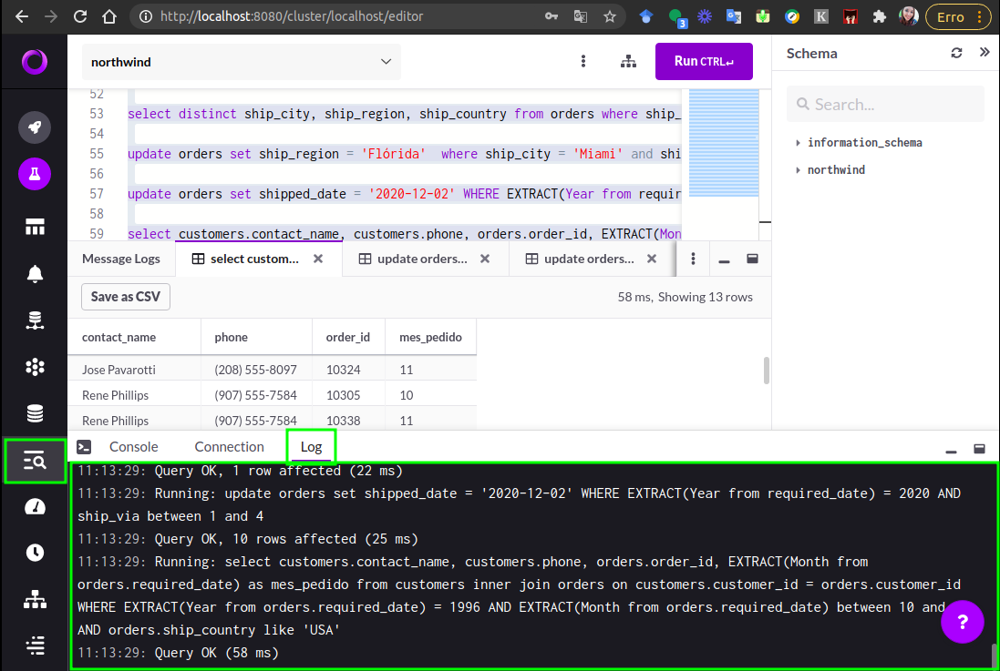
  

  

  <caption> Figura 25: Exemplos de saídas após executar os comandos   Fonte: Elaborado pelos autores </caption>

**Atenção:** Caso um nó crítico seja desativado, ao executar o Grupo B de comandos você terá uma saída semelhante a da Figura 26, com um erro tipo  **ERROR 1777 ER_DISTRIBUTED_PARTITION_HAS_NO_INSTANCES**.   Isso representa que o sistema não está disponível pois um nó que continha uma partição *master* foi desabilitado e não há nenhuma réplica deste nó *online*. Com isto o sistema para de responder com a finalidade de evitar problemas de integridade.

  
 

  

  <caption> Figura 26: Falha na execução com 4 nós ativos no MemSQL   Fonte: Elaborado pelos autores </caption>

**Observação:** Caso queira **retomar o funcionamento do nó** que sofreu a queda, basta retornar ao *SQL Editor* do MemSQL Studio e executar o comando `ATTACH LEAF '127.0.0.1':3307;`. Aguarde o sistema confirmar a operação. O mesmo pode ser feito com outros nós, apenas modificando a porta da *Leaf* que deseja reativar no *cluster*.

Uma avaliação dos resultados será feita na seção a seguir.

## 4.3 Resultados e comparações entre o CockroachDB e o MemSQL

Na prova de conceito efetuada com o CockroachDB e o MemSQL sobre a disponibilidade dos sistemas, ambos tiveram resultados satisfatórios mesmo ao forçar a queda de um nó no *cluster*, conforme práticas efetuadas neste tutorial. Realmente os sistemas cumprem o aspecto de alta disponibilidade (*high availability*) prometidos em suas documentações oficiais.

Porém, foram notadas algumas caraterísticas que diferenciam cada sistema *NewSQL* utilizado quando se fala de alta disponibilidade na prática. O Quadro 1 apresenta um resumo dessas diferenças e de características presentes em cada prova de conceito realizada, sendo elas discutidas a seguir.

  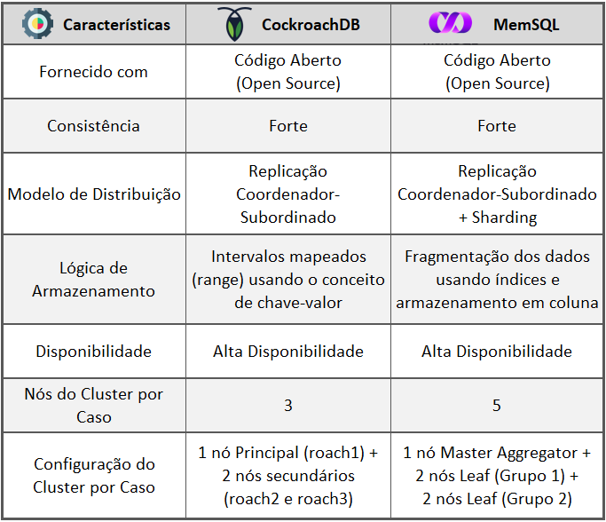
 

  

  <caption> Quadro 1: Características dos Sistemas CockroachDB e MemSQL   Fonte: Elaborado pelos autores </caption>

A justificativa para a elaboração desse *layout* na organização dos *clusters* deve-se à composição de uma estrutura mínima que atendesse ao fator de alta disponibilidade em cada sistema *NewSQL*. Portanto, o conteúdo prático das provas de conceito foram iguais nos dois estudos de caso, com o intuito de verificar se a disponibilidade dos dados era mantida mesmo diante da queda de um nó, mas cada sistema necessitava de uma composição diferente em seu *cluster*.

Todavia, para os dois SGBDs *NewSQL*, a queda de um dos nós no teste não poderia ser o Principal (ou *Master*), devido a ambos usarem o modelo de distribuição de coordenador-subordinado e terem a necessidade do nó *Master* estar em operação para o sistema se manter disponível. 

Em relação aos nós secundários do CockroachDB, independente de qual nó tivesse a queda, o sistema manteve-se disponível. Ele só ficou indisponível quando eram desativados os dois nós secundários e mantido somente o nó principal em funcionamento. Na Figura 27 há um exemplo em que foi feita a queda em todos os nós secundários e enviada uma consulta *SELECT*. O terminal ficou *“em espera”* e só retornou a consulta ao reativar um dos nós secundários.

  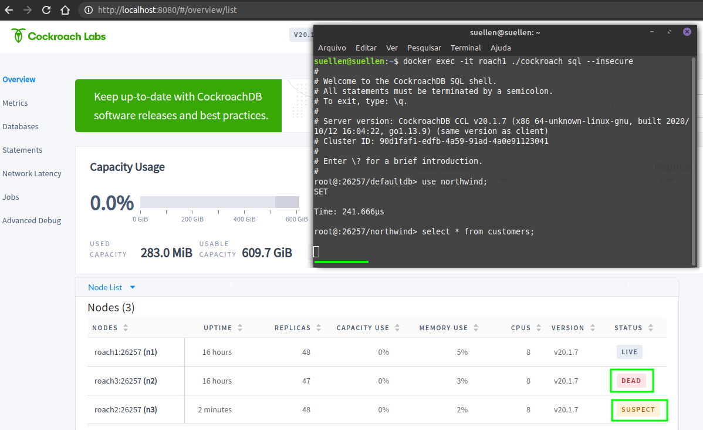
 

  

  <caption> Figura 27: Situação em que o sistema ficaria indisponível no CockroachDB   Fonte: Elaborado pelos autores </caption>

O comportamento exibido na Figura 27 é justificado pela lógica de armazenamento utilizada pelo CockroachDB, uma vez que os dados que pertencem a um mesmo registro armazenado em uma tabela são salvos em vários intervalos mapeados e replicados entre diferentes nós do *cluster*. Mesmo efetuando uma operação de leitura, como o *SELECT*, devido a arquitetura do CockroachDB o nó *Master* depende de consultar dados (por meio de chaves) em *ranges* localizados nos nós secundários [(COCKROACH LABS, 2020b)](#COCKROACH-2020B). Sendo assim, as combinações de nós possíveis no *cluster* do CockroachDB, considerando que o nó *Master* sempre estará *online*, é representada pelo Quadro 2.

  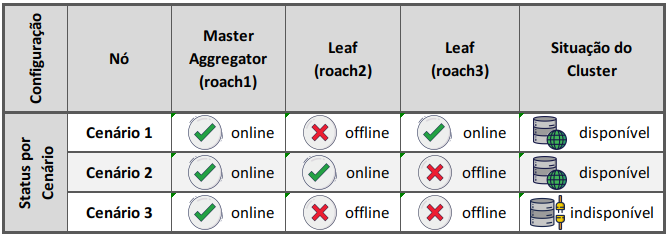
 

  

  <caption> Quadro 2: Cenários de disponibilidade do <em>cluster</em> no CockroachDB   Fonte: Elaborado pelos autores </caption>

Já no caso dos nós secundários existentes no *cluster* do MemSQL a disponibilidade dos dados depende em qual grupo de redundância cada nó opera. Um grupo de disponibilidade é um conjunto de nós que armazenam dados de maneira redundante para garantir alta disponibilidade. Cada grupo de disponibilidade contém uma cópia de cada partição do banco de dados, algumas como mestres e outras como réplicas. Atualmente, MemSQL suporta até dois grupos de disponibilidade [(MEMSQL, 2020b)](#MEMSQL-2020B), sendo eles o *grupo 1* e o *grupo 2*.

No ambiente organizado para a prova de conceito, os dois nós que pertencem ao grupo 1 não possuem cópias extras de seus dados e, caso ocorra uma falha em um nó secundário, o *cluster* fica *offline* até tal nó voltar ao sistema [(MEMSQL, 2020c)](#MEMSQL-2020C). Ou seja, independente do número de nós que o *cluster* tivesse, se todos os nós fossem de grupo 1, a queda de um dos nós tornaria o sistema indisponível. Outros dois nós do *cluster* do MemSQL foram configurados com grupo 2, que são capazes de lidar com falhas em nós secundários e gerar réplicas dos dados para manter o sistema *online*. 

Mesmo com essa configuração, a disponibilidade do banco só será mantida se houver a queda de alguns nós secundários e não todos. Essas configurações que podem ser aplicadas nos nós refletem também no algoritmo de balanceamento utilizado por cada grupo de nós em relação à distribuição dos dados no *cluster* [(MEMSQL, 2020c)](#MEMSQL-2020C). O Quadro 3 exibe diferentes combinações de nós (com *status* de *online* e *offline*) do *cluster* do MemSQL, considerando a mesma disposição elaborada para a prova de conceito, com o intuito de exemplificar em quais casos a disponibilidade dos dados seria mantida.

  
 

  

  <caption> Quadro 3: Cenários de disponibilidade do <em>cluster</em> no MemSQL   Fonte: Elaborado pelos autores </caption>

Diante de uma análise das combinações apresentadas no Quadro 3, apenas duas combinações podem ser generalizadas ao considerar o *cluster* na situação de disponível: quando fica *offline* somente um nó do grupo 1; ou quando há queda de apenas um nó do grupo 2. Como o MemSQL trabalha com a fragmentação dos dados usando índices e cada nó é relacionado a um nó específico para a troca de dados (em sua configuração padrão), a queda de um nó em particular pode trazer mais danos ao funcionamento do *cluster*. Por exemplo, o nó configurado na 3310, ao ser o único nó do grupo 2 a sofrer uma queda, junto de qualquer outro nó do grupo 1 que também esteja *offline*, torna o *cluster* indisponível (cenários de 11 à 14). O *cluster* apresenta menos chance de se tornar indisponível quando, nesta mesma lógica, o nó do grupo 2 desativado é o de porta 3309 (cenários de 4 à 7).

De maneira geral, os sistemas realmente conseguem manter a disponibilidade dos dados caso ocorra queda de um nó. Porém, para fornecer um banco de dados persistente a cenários mais “drásticos” é necessário utilizar da versão paga do *software*, disponibilizada por cada sistema *NewSQL*, com a finalidade de aplicar outras estruturas e configurações capazes de deixar tanto o CockroachDB como o MemSQL ainda mais robustos em relação ao fator de disponibilidade.

| :-------:
| [Voltar ao Sumário](#sumario)

# 5 Conclusão

A finalidade deste tutorial foi apresentar uma visão prática do aspecto de disponibilidade aplicado em dois sistemas *NewSQL* diferentes por meio de uma prova de conceito. A disponibilidade foi abordada a partir do uso da mesma base de dados (a *Northwind*) nos SGBDs CockroachDB e MemSQL, sendo replicado os mesmos grupos de comandos *SQL* em cada uma das provas de conceito.

Sobre a preparação dos ambientes para a utilização de cada sistema, como a instalação de ferramentas e a organização do *cluster*, usuários com mais experiência em ambiente Linux e com conhecimentos prévios em Docker podem apresentar mais facilidade para a realização deste tutorial. Quanto a “subir” a base de dados *Northwind* e efetuar comandos (como leituras e gravações) os sistemas *NewSQL* podem ser de simples operação aos usuários que possuem conhecimentos básicos de *SQL*, uma vez que elas utilizam da mesma linguagem usada por SGBDs relacionais.

Já em relação às provas de conceitos apresentadas neste tutorial, elas serviram para fornecer uma breve experiência sobre como cada sistema *NewSQL* iria se comportar, frente a queda de um nó no *cluster*. Como discutido na [Seção 4.3](#resultados-sec4c), cada sistema precisa de um ambiente mínimo diferente para fornecer alta disponibilidade dos dados e, por isso, o *cluster* de cada prova de conceito tinha quantidade de nós e configurações distintas. Todavia, os grupos de códigos e processos aplicados foram os mesmos nos dois estudos de caso.

Os dois estudos de caso apresentaram um funcionamento positivo de cada sistema, mantendo a disponibilidade dos dados mesmo com a queda de um nó. Porém, é preciso levar em conta o modelo de distribuição e a lógica de armazenamento em que cada sistema funciona, para compreender os diferentes cenários em que tanto o CockroachDB como o MemSQL são capazes de manter a disponibilidade dos dados. Outro fator para garantir a alta disponibilidade é a aquisição das versões pagas do CockroachDB e do MemSQL, tendo em vista que as versões gratuitas dos sistemas limitam o uso de determinadas configurações, capazes de manter a alta disponibilidade dos dados.

## 5.1 Sumarização do que foi aprendido

Entre os aprendizados que puderam ser absorvidos pelo grupo que desenvolveu o tutorial, e que também podem ser obtidos por parte de alunos e professores da área de Ciência da Computação ao estudarem este material são:

- Conhecimentos acerca dos aspectos teóricos que envolveram as provas de conceito apresentadas;
- Aprendizagem prática que incorporou desde a instalação de aplicações (Docker, CockroachDB e MemSQL), até a configuração dos *clusters* e realização das provas de conceito;
- Experiência prática no ambiente Linux para realizar todas as configurações necessárias e gerar um ambiente apto para ser utilizado por cada sistema *NewSQL*;
- Experiência prática ao operar a base de dados *Northwind* nos sistemas CockroachDB e no MemSQL;
- Compreensão sobre as diferentes arquiteturas de cada SGBD *NewSQL* usado neste tutorial e como elas influenciam na disponibilidade de cada sistema.

# 6 Glossário

**ACID** – Acrônimo de *Accessible, Consistent, Indivisible and Disponibile*, que significa em português:  Acessível, consistente, indivisível e disponível.

**Agregrator ou agregador** - Um *cluster*, nó, *container* ou nó que será responsável pelo gerenciamento da comunicação de todos *clusters*, *containers* ou nós criados relacionados ao agregador. 

**API** - Acrônimo de *Application Programming Interface*, traduzindo para o português: Interface de Programação de Aplicativos, que é um conjunto de rotinas e protocolos usados em programação para a integração de *software* de aplicações.

**APT** - *Advanced Packaging Tool* que significa em português: Ferramenta de Empacotamento Avançada, é um conjunto de ferramentas do GNU/Linux Debian e suas respectivas distribuições, para administrar os pacotes, utilizando o comando `apt– comando` para a instalação, atualização e remoção de pacotes do sistema.

 **ATTACH LEAF** - Comando que fará a transição do *leaf* no MemSQL do estado *detached* - desconectado, para o estado *online*.

**BD** - Acrônimo de Banco de Dados.

**Big Data** - Conceito de armazenamento, análise e manipulação de grandes volumes de dados.

 **CA** - Acrônimo de *Certificate Authority*, em português: autoridade de certificação, que é um módulo responsável por emitir certificados digitais a fim de averiguar identidades na internet.  Neste tutorial ele é invocado sucedido do comando `certificates` para habilitar o sistema a realizar esta averiguação.

**Caixa preta** -  É um modo que o sistema será executado, onde não é necessário ter acesso ao código fonte ou interagir com alguma configuração, porém a execução é transparente e automática.

**CAP** - Acrônimo de *Consistency, Availability e Partition tolerance*, em português: consistência, disponibilidade e tolerância à partição. É um teorema do paradigma de NoSQL, que se apóia na afirmação de que, para se atender ao menos dois destes parâmetros citados, deve-se desistir de atender a um dos três parâmetros. 

**Cluster** - É um conjunto de  instâncias de replicação do banco de dados, podendo ser um conjunto de computadores, servidores, *containers* ou nós dependendo da estrutura utilizada.

**Container** – Uma metodologia usada para empacotar aplicações e todas suas dependências, para que possam ser instaladas e utilizadas de forma isoladas em um repositório.

**CPU** - Acrônimo de *Central Process Unit*, em português: Unidade Central de Processamento, onde iremos verificar os dados estatísticos referentes ao processamento das atividades nos sistemas de banco de dados.

**Create Database** - Comando *SQL* utilizado para criar um banco de dados.

**Create table** - Comando *SQL* utilizado para criar uma tabela.

**Curl** - *Client URL*, em português *URL* do cliente, que é uma ferramenta utilizada para obter e enviar dados em vários protocolos. 

**DETACH LEAF** - Comando que fará a transição do *leaf* no MemSQL do estado *online* para o estado *detached* - desconectado.

**Delete** - Comando utilizado para apagar um registro existente. 

**Docker Client** – É um comando que recebe as instruções do usuário e repassa estes comandos ao *Docker daemon*, uma camada que irá executar propriamente os comandos.

**Docker Compose** – Usado para definir aplicações usando diversos *containers*, ou diversas configurações simultâneas para criação de *containers*.

**Docker Container** – Um *container* que contém uma aplicação isolada e independente, ao utilizar este comando, o *container* pode ser criado, configurado, executado e parado de acordo com as instruções subsequentes a ele.

**Docker Hub** - É o repositório *online* usado para hospedar e baixar diversas imagens.

**Docker Image** – É um espelho de um sistema pré-definido, contendo todos os metadados para executar um *container* a partir deste espelho.

**Docker network** – Comando usado para criar e gerenciar uma estrutura de redes dentro do Docker.

**Docker pull** – Comando que verifica se há uma imagem no Docker local, caso contrário baixa do repositório indicado ou no Docker hub.

**Escalabilidade** - Em banco de dados é o aumento no número de equipamentos físicos (computadores em funcionamento) ou o aumento da capacidade dos equipamentos (maior capacidade de *hardware* por compurtador) onde o SGBD está instalado.

**Insert into** - Comando *SQL* utilizado para inserir dados em uma tabela.

**Latência das transações**- É o tempo de resposta entre início do comando e o término da execução da ação por parte do sistema. 

**Leaf** - É um nó que armazena um subconjunto de dados de um *cluster*. 

**Log** - É um registro de atividades do sistema.

**Master** - Na topologia Coordenador – subordinado o termo *Master* indica o nó coordenador.

**Node, nodes** - Em português Nó, é um servidor que possui uma instalação de uma instância única de um sistema de banco de dados.

**Northwind** - É um banco de dados fictício criado pela Microsoft para ser utilizado em estudos.

**NoSQL** - Paradigma de banco de dados que não utiliza necessariamente a linguagem *SQL* para construção de banco e consulta.

**OLTP** - Acrônimo de *Online Transaction Processing*, em português, Processamento De Transações *Online*, que são sistemas que registram todas as transações contidas em uma operação de uma organização.

**Redundância dos dados** - É a duplicação e divisão dos dados em locais diferentes, visando garantir serviço ininterrupto e evitar a perda de dados.

**Select** - Comando *SQL* usado para recuperar os dados de um objeto do banco de dados, como uma tabela, uma linha, ou uma coluna.

**SGBD** - Acrônimo de *Sistema Gerenciador de Banco de Dados*.

**SGBDR** - Acrônimo de *Sistema Gerenciador de Banco de Dados Relacional*.

**Sharding** -   É o termo utilizado para a fragmentação dos dados em diversos nós.

**SHOW LEAVES** - Comando *SQL* utilizado no MemSQL, para recuperar e exibir as leaves existentes.

**Software-properties-common** - *Script* que permite que você gerencie facilmente sua distribuição e fontes de *software* independentes de fornecedores de *software*.

**SQL** - *Structured Query Language*, ou *Linguagem de Consulta Estruturada*, é a linguagem utilizada para criar banco de dados relacionais e recuperar os dados.

**Sudo** - comando de Super usuário do Linux, que concede permissões para utilizar outros comandos como administrador.

**Topologia** - É o nome dado a definição da estrutura de TI, no nosso é a estrutura de divisão de nós do banco de dados.

**Throughput** - Taxa de transferência que é a quantidade de dados que trafegam em um determinado espaço de tempo.

**USE** - Comando *SQL* utilizado para indicar o banco de dados que será utilizado.

**Windows Power Shell** - Terminal de linha de comando do Windows.

**WSL** – Acrônimo de Windows Subsystem  for Linux, em português: Subsistema do Windows para Linux.

| [Voltar ao Sumário](#sumario)

# Referências Bibliográficas

BRITO, Michelli. [Containers e Docker](https://www.youtube.com/watch?v=TR8zX1D6abU). Canal Michelli Brito, 2020. 

COCKROACH LABS. [CockroachDB: Distributed SQL](https://www.cockroachlabs.com/product/). Cockroach Labs, 2020a. 

COCKROACH LABS. [CockroachDB: Architecture Overview](https://www.cockroachlabs.com/docs/v20.1/architecture/). Cockroach Labs, 2020b. 

COSTA, Matheus Bigogno. [O que é Benchmark?](https://canaltech.com.br/hardware/O-que-e-Benchmark/). CanalTech, 2020. 

DOCKER. [What is a Container?: a standardized unit of software](https://www.docker.com/resources/what-container). Docker Inc. 2020. 

KAUR, Karambir; SACHDEVA, Monika [Performance evaluation of NewSQL databases](https://ieeexplore.ieee.org/document/8068585). 2017 International Conference on Inventive Systems and Control (ICISC), 2017, Coimbatore, India. p. 1 - 5. DOI 10.1109/ICISC.2017.8068585. 

KNOB, Ronan R. et al. [Uma Análise de Soluções NewSQL](https://sol.sbc.org.br/index.php/erbd/article/view/8475). In: XV Escola Regional de Banco de Dados (ERBD), 2019, Chapecó. Porto Alegre: Sociedade Brasileira de Computação, p. 21 - 30. ISSN 2595-413X. 

MEMSQL. [How MemSQL Works](https://docs.memsql.com/v7.1/introduction/how-memsql-works/). MemSQL Docs, 2020a.  

MEMSQL. [High Availability](https://docs.singlestore.com/v7.3/key-concepts-and-features/distributed-architecture/high-availability/). MemSQL Docs, 2020b.  

MEMSQL. [Managing High Availability (MemSQL Ops)](https://docs.singlestore.com/v7.1/tools/memsql-ops/managing-high-availability/). MemSQL Docs, 2020c.  

MOLL, Vinicius. [Como construir uma aplicação com Docker?](https://blog.geekhunter.com.br/docker-na-pratica-como-construir-uma-aplicacao/) GeekHunter, 2019. 

MONGODB. [MongoDB Documentation: Replication](https://docs.mongodb.com/manual/replication/). 2020. 

PAT RESEARCH. [CockroachDB](https://www.predictiveanalyticstoday.com/cockroachdb/). Pat Research - Predictive Analytics Today, 2020. 

REZENDE, Ricardo. [Alta disponibilidade no banco de dados Oracle](https://www.devmedia.com.br/alta-disponibilidade-no-banco-de-dados-oracle/28971). DevMedia, 2013. 

STONEBRAKER, Michael, CATTELL, [Rick. 10 Rules for Scalable Performance in ‘Simple Operation’ Datastores](https://doi.org/10.1145/1953122.1953144). Communications Of The Acm, v. 54, n. 6, p. 72-80, jun. 2011. 

STONEBRAKER, Michael et al. [The End of an Architectural Era (It’s Time for a Complete Rewrite)](http://nms.csail.mit.edu/~stavros/pubs/hstore.pdf). VLDB '07: Proceedings Of The 33Rd International Conference On Very Large Data Bases, p. 1150-1160, jul. 2007. 

WIKIPEDIA. [Sistema de alta disponibilidade](https://pt.wikipedia.org/wiki/Sistema_de_alta_disponibilidade/). 2020. 

YUGABYTE. [Northwind sample database](https://docs.yugabyte.com/latest/sample-data/northwind/). YugabytesDB, 2020.
